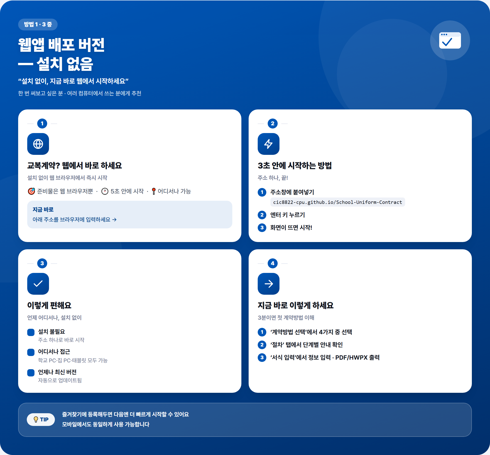
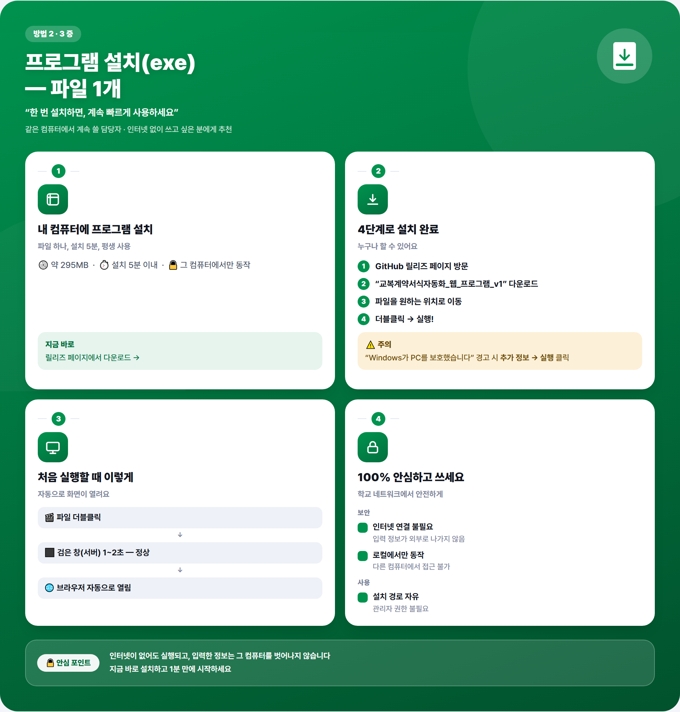
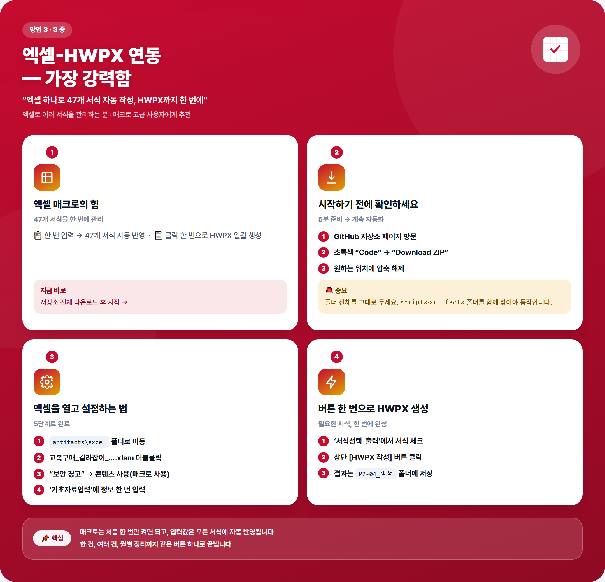

# 교복 학교주관구매 길라잡이

교복 학교주관구매 업무를 안내하고, 계약·구매 서식을 Excel·HWPX·PDF로 자동 작성해주는 프로그램입니다.

**사용 중 어떤 값도 인터넷으로 전송되거나 외부 서버에 저장되지 않습니다.** 입력한 정보, 업로드한 엑셀 내용은 전부 그 컴퓨터의 브라우저(또는 Excel) 안에서만 처리됩니다.

글보다 그림이 편하시면, 아래 카드뉴스만 보고도 세 가지 방법을 바로 이해하실 수 있습니다. (각 방법 설명 위에도 같은 카드가 있습니다.)

---

## 어떤 방법을 쓰면 될까요?

| | 1. 웹에서 바로 쓰기 | 2. 프로그램 설치(exe) | 3. 엑셀 자동화 (가장 강력함) |
|---|---|---|---|
| 설치 | 필요 없음 | 파일 1개 다운로드 | 저장소 전체 다운로드 |
| 인터넷 | 접속할 때만 필요 | 실행할 때는 필요 없음 | 필요 없음 |
| 준비물 | 웹 브라우저만 | 없음 | Microsoft 365 또는 한컴오피스 |
| 할 수 있는 일 | 절차 안내·서식 확인·입력·PDF/HWPX 출력·인쇄 | 1번과 동일 (내 컴퓨터에 고정 설치) | 1·2번 + 엑셀 매크로로 서식 47종 자동 반영·일괄 HWPX 작성 |
| 추천 대상 | 한 번 써보고 싶은 분, 다른 컴퓨터에서도 쓰는 분 | 같은 컴퓨터에서 계속 쓰실 담당자 | 엑셀로 여러 서식을 한 번에 관리하실 담당자 |

잘 모르시겠으면 **2번(프로그램 설치)**을 추천합니다. 인터넷 없이도 항상 쓸 수 있고, 설치도 파일 하나만 받으면 됩니다.

---

## 1. 웹에서 바로 쓰기 (설치 없음)

1. 아래 주소를 웹 브라우저(크롬, 엣지 등)에서 엽니다.

   **https://cic8822-cpu.github.io/School-Uniform-Contract/**

2. 화면 안내에 따라 계약방법을 고르고, 절차·서식을 확인하시면 됩니다.
3. 즐겨찾기에 등록해두시면 다음에도 같은 주소로 바로 들어오실 수 있습니다.

> 이 화면에서 입력하신 내용은 그 컴퓨터의 브라우저 안에만 남고, 저장하지 않으면 창을 닫는 순간 사라집니다. 계속 쓰실 거라면 2번(프로그램 설치)을 권합니다.

---

## 2. 프로그램 설치(exe) — 한 번 설치하면 계속 사용

1. 아래 페이지로 들어갑니다.

   **https://github.com/cic8822-cpu/School-Uniform-Contract/releases/tag/v1.0.0**

2. **Assets** 목록에서 "교복계약서식자동화_웹_프로그램_v1"(실제 파일명 `UniformContractGuide_v1.exe`)을 클릭해 다운로드합니다.
3. 다운로드한 파일을 원하는 위치(예: 바탕화면, 문서 폴더)로 옮겨 놓습니다.
4. 파일을 더블클릭해서 실행합니다.
   - 검은 창(서버)이 잠깐 뜨고, 잠시 후 기본 브라우저가 자동으로 열리며 프로그램 화면이 나타납니다.
   - "Windows가 PC를 보호했습니다" 같은 경고가 뜨면 **추가 정보 → 실행**을 눌러주세요(서명되지 않은 새 프로그램이라 뜨는 일반적인 안내이며, 실행에는 문제없습니다).
5. 다음에 또 쓰실 때도 같은 파일을 다시 더블클릭하시면 됩니다. 프로그램을 켜둔 검은 창을 닫으면 프로그램도 함께 종료됩니다.

**보안 안내**: 이 프로그램은 실행한 그 컴퓨터 안에서만 동작합니다(`localhost`). 인터넷을 거치지 않고, 다른 컴퓨터나 외부에서 이 프로그램에 접속할 수 없습니다. 학교 인터넷 연결 여부와 무관하게 안심하고 설치·운영하실 수 있습니다.

---

## 3. 엑셀-HWPX 연계 프로그램 (서식 자동 작성)

여러 서식(구매요청 기안문, 평가표, 계약서 등)을 엑셀 하나에서 관리하고, 버튼 한 번으로 HWPX 공문서까지 자동으로 만들고 싶으신 분께 추천합니다.

### 준비물
- Windows PC
- **Microsoft 365(엑셀)** 또는 **한컴오피스**가 설치되어 있어야 합니다.

### 설치 방법

1. 저장소 페이지(**https://github.com/cic8822-cpu/School-Uniform-Contract**)에서 초록색 **`< > Code`** 버튼을 누른 뒤 **Download ZIP**을 클릭합니다.
2. 다운로드한 zip 파일의 압축을 원하는 위치에 풉니다.
   - ⚠️ **폴더 전체를 그대로 두세요.** 엑셀 파일만 따로 꺼내서 쓰시면 안 됩니다. 엑셀의 자동 기능은 같은 폴더 안의 `scripts`, `artifacts` 폴더를 함께 찾아서 동작합니다.
3. 압축을 푼 폴더 안에서 `artifacts` → `excel` 폴더로 들어가 **`교복구매_길라잡이_20260924_v17.xlsm`** 파일을 엽니다.
4. 엑셀 상단에 "보안 경고 — 매크로 사용" 안내가 뜨면 **콘텐츠 사용(매크로 사용)**을 눌러주세요. (매크로를 켜야 자동 기능이 동작합니다.)

### 사용 방법

1. `기초자료입력` 시트에서 학교명·계약방식·일정 등 기본 정보를 한 번 입력합니다.
2. `서식선택_출력` 시트에서 필요한 서식을 체크하고 출력하거나, 각 서식 시트에서 바로 확인할 수 있습니다.
3. **[HWPX 작성]** 버튼을 누르면 체크한 서식이 한글(HWPX) 공문서 형식으로 자동 생성됩니다.
4. 결과 파일은 `artifacts\hwpx\P2-04_생성` 폴더에 저장됩니다.

자세한 사용법은 엑셀 파일 안의 **`사용설명서`** 시트를 참고해 주세요.

---

## 문제가 생겼을 때

- **exe 실행이 안 돼요** → 다른 프로그램이 같은 포트를 쓰고 있을 수 있습니다. 검은 창에 뜬 안내 문구를 확인해 주시고, 그래도 안 되면 PC를 재시작한 뒤 다시 시도해 주세요.
- **엑셀에서 "HWPX 작성 도구가 있는 프로젝트 폴더를 찾지 못했습니다"라고 나와요** → zip을 통째로 받지 않고 엑셀 파일만 따로 옮기신 경우입니다. 폴더 전체를 다시 받아 그 안에서 엑셀을 열어주세요.
- **그 외 문의** → 이 저장소의 [Issues](https://github.com/cic8822-cpu/School-Uniform-Contract/issues) 탭에 남겨주시면 확인하겠습니다.

---

**관련 링크**: [웹앱 바로가기](https://cic8822-cpu.github.io/School-Uniform-Contract/) · [exe 다운로드](https://github.com/cic8822-cpu/School-Uniform-Contract/releases/tag/v1.0.0)
