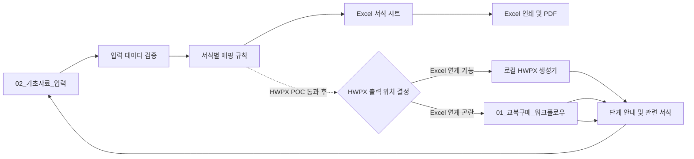

# 계획.md — 교복구매 길라잡이 Excel MVP 및 웹앱 전환

- **상태(2026-09-25 갱신)**: `P0~P4 전체 DONE(사용자 결정 포함) · P5-01 IN_PROGRESS` — Excel MVP(F-001~F-052 중 51종), HWPX 로컬 연계(P2-04, 48/48), 현장 검증(사용자 자체 PC 2대 반복 확인으로 갈음)까지 완료 처리하고 웹앱 개발(P5)에 착수함. 상세 근거는 `ADR-001-HWPX출력방식.md`와 하단 변경 이력 참고.
- **작성일**: 2026-09-15
- **우선순위**: 웹앱 요구사항·UX 설계(P5-01/02) → 웹 MVP 구현(P5-03)
- **원본 보존 원칙**: 제공된 `.hwpx`·`.xlsm` 원본은 읽기 전용으로 취급하고, 모든 분석·변환·생성은 사본과 별도 산출물에서 수행함.

> **핵심 결론:** Excel의 단일 기초자료 입력과 선택 출력은 바로 설계할 수 있으나, **Excel에서 HWPX를 자동 생성하는 방식은 아직 결정·검증되지 않았음.** 이 경계를 확정하지 않은 상태에서 서식 57종 전체를 구현하면 재작업 위험이 큼.

---

## 1. 목표 및 범위

### 1.1 최종 목표

학교 교사와 행정실 직원이 교복 학교주관구매의 업무단계를 따라가며, 공통 기초자료를 한 번 입력하고 필요한 공문·계약서·평가표·가정통신문·설문지·검수서식을 선택하여 Excel, PDF 및 검증된 범위의 HWPX로 출력할 수 있는 도구를 구축함.

### 1.2 단계별 제공 범위

| 단계 | 제공물 | 범위 |
|---|---|---|
| 1단계 | Excel MVP | 워크플로우, 기초자료 입력, 확정 인벤토리의 전체 서식(사용자 목표 57종), Excel 인쇄/PDF |
| 2단계 | HWPX POC | 대표 3종 템플릿화 및 값 치환·재열기·레이아웃 검증 |
| 3단계 | Excel/HWPX 확대 | Excel 출력은 순차 확장하고, Excel에서 HWPX 출력이 어려우면 승인된 HWPX 생성 기능을 웹앱으로 이관 |
| 4단계 | 웹앱 MVP | 절차 안내, 입력, 문서 생성·다운로드; Excel HWPX 출력 난항 시 HWPX 출력의 대체 구현 경로 |

### 1.3 MVP에서 제외하는 항목

- 학생별 이름·치수·주문·설문 원자료의 저장 및 통합 관리
- 직인·서명 이미지의 자동 삽입 및 보관
- 계약 문구·법령·금액기준을 근거 없이 자동 판정하거나 임의 변경하는 기능
- 기존 XLSM의 외부 연결, 깨진 이름 정의, 매크로를 그대로 복사하는 방식
- HWPX 생성 방식이 검증되기 전의 웹 브라우저 내 HWPX 생성 약속

---

## 2. 검토 결과와 반영 사항

### 2.1 확인한 사실

| 대상 | 확인 결과 | 계획 반영 |
|---|---|---|
| 교복 매뉴얼 HWPX | Kordoc `validate` 구조 검증 통과, 섹션 XML 1개, `BinData` 항목 46개 | 서식 경계는 장/섹션 수가 아닌 문단·표·이미지 배치 순서로 판별함 |
| 기존 XLSM | 워크시트 XML 11개, VBA 프로젝트 존재, 외부 링크 항목 2개, 연결 설정 존재 | 기능만 벤치마킹하고 외부 의존성·VBA를 클린룸 방식으로 재구현함 |
| 사전리서치 | 22종 자동인식과 사용자가 언급한 57개가 불일치하며 일부 외부 사례는 미확인 표시됨 | 인벤토리 확정 전에는 서식 수를 일정·완료조건으로 고정하지 않음 |
| HWPX 템플릿 | 원본에 `{{변수명}}` 표식이 있다고 확인되지 않음 | 복사본 3종에서 템플릿화 가능성부터 실증함 |

### 2.2 코드리뷰어 핵심 권고 반영

1. **P0 — 출력 책임 분리**: Excel XLSM은 입력·검증·미리보기·Excel/PDF 출력과 로컬 보조도구 호출을 담당하고, HWPX는 별도 POC에서 확정한 생성기만 담당함.
2. **P0 — 템플릿화 선행**: HWPX 대량 구현 전에 대표 3종에서 변수 표식, 반복 표, 저장·재열기, 한컴 열기, PDF 결과를 검증함.
3. **P0 — 인벤토리 기준 통일**: 서식, 템플릿, 이미지 자산, 이미지 배치, 참고자료를 서로 다른 수치로 관리함.
4. **P1 — 데이터 모델 선행**: 공통값·문서별 값·반복행·계산값·문서 버전과 매핑 규칙을 분리함.
5. **P1 — 골든 테스트 도입**: 정상·누락·최대길이·복수 업체/위원 입력을 기준 데이터로 고정하고, 승인된 Excel/HWPX/PDF 결과와 비교함.
6. **P1 — 보안 경계 설정**: 개인·계약정보·직인은 최소수집, 저장금지 또는 보유목적·기간·마스킹 규칙을 명시한 뒤에만 취급함.

---

## 3. 목표 아키텍처 초안

### 3.3 실행 하네스

| 구분 | 구성 | 적용 역할 |
|---|---|---|
| 실행 모드 | 하이브리드(병렬 분석 + 순차 구현·검증) | 독립 분석은 병렬 수행하고, HWPX POC→XLSM 구현→품질 검증은 선행 산출물을 넘김 |
| 분석 에이전트 | `uniform-workflow-analyst` | 매뉴얼·서식 인벤토리·근거·입력필드 분석 |
| 문서자동화 에이전트 | `document-automation-engineer` | Kordoc POC, HWPX 템플릿화·생성·검증 |
| Excel 에이전트 | `excel-automation-engineer` | XLSM 워크플로우·자동반영·선택출력 구현 |
| 품질 에이전트 | `quality-compliance-reviewer` | 출력·회귀·개인정보·배포 전 독립 검토 |
| 오케스트레이터 | `.claude/skills/uniform-purchase-orchestrator/SKILL.md` | 계획 기반 재개, 산출물 전달, 차단 항목 관리 |
| Goal 운영 스킬 | `.claude/skills/uniform-purchase-goal/SKILL.md` | `/goal` 조건 작성·상태 확인·복구 절차 |

중간 산출물은 `_workspace/00_input`~`04_qa`, 최종 생성 문서는 `artifacts/excel`, `artifacts/hwpx`, `artifacts/pdf`에 보관함.

### 3.1 Excel MVP 워크북 구성

| 시트 | 역할 | 구현 원칙 |
|---|---|---|
| `01_교복구매_워크플로우` | 9단계 흐름, 단계별 체크리스트·서식 이동 | 하이퍼링크 우선, 매크로 버튼은 승인 후 사용 |
| `02_기초자료_입력` | 학교·사업·일정·단가 등 공통 정보 입력 | 입력/자동계산 셀 구분, 유효성 검사 적용 |
| `03_서식선택_출력` | 단계별 서식 선택·필수값 누락·인쇄 대상 확인 | Form ID, 출력 유형, 누락 상태를 표시 |
| `Fxx_서식명` | 원본을 실무 출력 수준으로 재현한 개별 서식 | 공통 필드 Named Range 또는 테이블 참조 |
| `DB`, `Ref_data`, `학교정보`, `서식Metadata` | 코드·드롭다운·매핑·버전 관리 | 일반 사용자 수정 방지, 외부 링크 0개 |
| `Print_sheet` | 선택한 서식의 인쇄 작업 영역 | 대표서식 출력 검증 후 필요 시 구성 |
| `사용설명서` | 설치·입력·출력·오류 대응 | Windows, Microsoft 365, 한컴오피스 및 XLSM 매크로 허용 절차 명시 |

### 3.2 데이터 모델 최소 단위

| 영역 | 핵심 데이터 | 모델링 원칙 |
|---|---|---|
| 기준정보 | 학교, 학년도, 담당자, 결재권자 | 기준값과 문서 발행 시점 값을 분리 |
| 사업 | 품목, 동복/하복, 상한가, 예정수량, 일정 | 표시값·계산값·확정값을 분리 |
| 절차 | 단계, 담당, 마감일, 체크리스트 | 단계 상태와 예외 사유를 기록 가능하게 설계 |
| 계약 | 입찰, 업체, 낙찰, 계약, 납품 | 업체·계약·품목은 반복행 테이블로 처리 |
| 평가·검수 | 위원, 항목, 점수, 검수 항목 | 가변 행 수를 단일 셀 참조로 고정하지 않음 |
| 문서 | Form ID, 원본 버전, 변수, 매핑, 출력 형식 | 원본·생성본·승인기준의 추적성 확보 |

---

## 4. 단계별 실행 계획

상태값: `TODO` / `IN_PROGRESS` / `BLOCKED` / `DONE`

| ID | 단계 | 작업 | 입력자료 | 산출물 | 완료조건(DoD) | 검증방법 | 상태 | 위험요인 |
|---|---|---|---|---|---|---|---|---|
| P0-01 | 준비 | 원본 파일 무결성·사본 작업 폴더 확정 | HWPX, XLSM, 조사자료 | 작업대상 목록 | 원본 5개 이상 읽기 전용 확인, 사본 경로 기록 | 파일 열기·해시 또는 구조검증 | DONE | 원본 덮어쓰기 |
| P0-02 | 준비 | Kordoc 실제 기능 및 제한 확인 | HWPX, Kordoc | `kordoc_기술검증.md` | 파싱·필드탐색·fill dry-run·patch·validate·render 가능 범위 기록 | 샘플 사본으로 명령 결과 확인 | DONE | 명령 인코딩/한글 경로, 원본 서식 손실 |
| P0-03 | 준비 | XLSM 벤치마크 기능·의존성 분류 | XLSM | `엑셀_벤치마크_분석.md` | 시트·이름정의·외부링크·연결·VBA·인쇄 흐름을 재사용/개선/제외로 분류 | Office 또는 OOXML/VBA 정적 분석 | DONE | 외부 통합문서·연결·매크로 경고 전파 |
| P1-01 | 인벤토리 | HWPX 문단·표·이미지 배치 순서 추출 | HWPX 사본 | `_workspace/01_analysis/HWPX_원시구조_목록.md` | 전체 문단·표·이미지 참조를 순서대로 추출 | 원본 페이지와 표본 대조 | DONE | 표·이미지 기반 서식 경계 오인 |
| P1-02 | 인벤토리 | 서식·참고자료·이미지 분리 및 Form ID 부여 | P1-01 | `서식_인벤토리.md` | 각 서식의 단계, 담당, 유형, 원본위치, 표·이미지 여부, 난이도, MVP 여부 기록 | 누락·중복 Form ID 검사, 업무담당자 표본 확인 | DONE | 22/57개 불일치 |
| P1-03 | 모델 | 공통·문서별·반복·계산 필드와 검증 규칙 정의 | P1-02 | `입력데이터_사전.md`, `서식_매핑표.md` | 모든 MVP 서식에 입력 출처·필수여부·형식·매핑 대상 기록 | 필드 누락·중복·개인정보 점검 | DONE | 모든 정보를 공통값으로 오인 |
| P1-04 | 결정 | 전체 서식 범위·HWPX POC 3종·문서 검토 책임 확정 | P1-02, P1-03 | `결정사항.md` | 실제 인벤토리에서 확정한 전체 서식이 57종 목표와 대조되고, POC 3종은 단순공문·반복/계산·복합표 유형을 포괄 | 사용자 확인 및 업무·계약 담당 검토 | DONE | 22종 자동인식과 57종 목표의 차이 |
| P2-01 | HWPX POC | 원본 HWPX 사본의 허용 공통값 자리만 `{{학교명}}` 등 명시 토큰으로 바꾸고 값 치환 시험 | P1-04 | 원본 보존형 템플릿·골든 결과·`_workspace/02_hwpx/P2-01/원본보존형_토큰검증.md`, Form ID별 확장판 `artifacts/hwpx/P2-04/` | 원본 HWPX를 변경하지 않고, 표·이미지·스타일·F-007 경계 밖 XML을 보존한 사본에만 명시 토큰을 삽입해 비식별 값으로 치환·저장·재열기 성공 | 원본 SHA-256, ZIP 엔트리·XML 경계·토큰 0·구조 검증, 한컴/PDF 비교 | DONE | P2-04(2026-09-23)에서 47개+ Form ID 전체로 확장하고 P2-02 한컴 검증까지 통과함(하단 갱신 이력 참고) |
| P2-02 | HWPX POC | 원본 보존형 생성본의 한컴 열기·PDF 비교·사람 검토 | P2-01 | 골든 HWPX/PDF | 원본 대비 결재란·병합표·글꼴·페이지·특수문자·이미지 보존을 확인 | 한컴 수동 열기, PDF 육안 비교 | DONE(2026-09-24) | 2026-09-24 사용자가 한컴에서 직접 열어 레이아웃을 육안 확인하고 통과로 확정함(`test.md` H-05) |
| P2-03 | 결정 | HWPX 출력 아키텍처 ADR 확정 | P2-01, P2-02 | `ADR-001-HWPX출력방식.md` | Excel 연계 가능 여부를 실증하고, 곤란하면 웹앱 HWPX 생성 경로·보안 경계를 결정. 복합 매뉴얼 전역 치환과 Form ID별 독립 템플릿·문서군 생성의 오염 방지성·추적성을 비교함 | 설치·보안·유지보수·학교망·개인정보·타 서식 오염 방지 기준 비교 | DONE(2026-09-25) | 결정: D3(로컬 PowerShell 보조도구 방식)를 그대로 채택. 학교 행정실 PC 대신 사용자 본인 PC 2대(사무실·자택) 반복 확인을 근거로 채택함 — 제3자·실제 학교 PC 검증은 아직 없음을 `ADR-001-HWPX출력방식.md`에 명시 |
| P3-01 | Excel MVP | 기준 XLSM의 실제 사용자 흐름을 분석하고 워크플로우·기초자료·참조 UI를 재설계 | P1-03, P1-04, 기준 XLSM 직접 검토 | 기준 기능·화면 분석서, 재설계 XLSM 초안, `P3-01_Excel_MVP_설계검증.md` | 기준 XLSM 수준의 입력 화면, 공통값 자동 반영, 필수값 오류 표시, 선택·출력 제어 설계를 구현 | 기준 파일과 신규 파일을 화면·기능 단위로 직접 비교 | DONE(2026-09-25) | 없음 — F-001~F-052 중 51종 구현·검증(PASS) 완료, F-013만 HWPX 경로 위임(설계상 확정). 금액 구간 자동판정만 법적 위험으로 영구 제외(X-06 주3) |
| P3-02 | Excel MVP | 대표 서식 조판·선택 출력 구현 후 전체 확정 서식으로 확장 | P3-01 | 승인된 `.xlsm` | 대표 서식의 표·병합·인쇄 조판과 선택 출력, 이후 52종 공통값 자동반영·개별 선택 인쇄 구현 | 골든 데이터와 Excel/PDF 비교 | DONE(2026-09-25) | 없음 |
| P3-03 | Excel MVP | 골든 테스트·사용설명서·배포 패키지 작성 | P3-02 | `test.md`, `체크리스트.md`, 사용설명서 | 정상/누락/최대길이/복수행 케이스와 57종 출력 목록 통과 | 회귀·부정·인쇄 테스트 | DONE(2026-09-25) | 없음 |
| P4-01 | 현장 검증 | 학교 담당자 시나리오 검증 및 결함 수정 | P3-03 | `로그.md`, 개선판 | 신규 담당자도 5개 대표서식 생성 완료 | 관찰기반 사용성 테스트 | DONE(2026-09-25, 사용자 결정으로 범위 조정) | 원래 DoD(신규 담당자·관찰기반 사용성 테스트)와 실제 완료 근거가 다름: 사용자 본인이 사무실·자택 PC 2대를 오가며 반복 사용·확인한 결과로 갈음함. 실제 학교 행정실 신규 담당자의 최초 사용 경험은 검증되지 않았음(잔여 리스크로 기록) |
| P5-01 | 웹 설계 | 웹 요구사항·기술·개인정보 ADR 확정 | Excel/HWPX 검증 결과 | `prd.md`, `ADR-002-웹앱아키텍처.md` | Excel HWPX 출력 곤란 시 웹앱 HWPX 생성 경로와 정적 웹·서버리스·DB 도입 기준을 확정하고, 절차 탐색은 정적 콘텐츠·작성 상태는 클라이언트 우선으로 분리 | 비용·접근성·보안·운영성·입력값 비영구 저장 비교 | IN_PROGRESS(2026-09-25, `ADR-002` 작성 완료·PROPOSED — 사용자 확인 후 DONE 전환) | `ADR-001`에서 "HWPX는 로컬 보조도구로 계속 처리"로 이미 결정했으므로, `ADR-002`는 웹앱이 서버·DB 없이 절차안내·기초자료 입력(팝업/엑셀 업로드)·클라이언트 사이드 PDF 출력을 제공하고 HWPX는 생성하지 않는 것으로 확정함. `prd.md` FR-07~FR-11도 이에 맞춰 갱신함. 남은 결정(PDF 생성 방식 세부·엑셀 업로드 파싱 범위·배포처)은 `ADR-002` §5 참고 |
| P5-02 | UX/UI | 업무 흐름 중심 Wireframe·디자인 시스템·접근성 검토 | P5-01 | `웹앱_UX설계.md` | 9단계 탐색 허브→단계 상세→관련 Form ID→입력·누락 검사→미리보기·다운로드 흐름과 현재 단계·이전/다음 이동을 정의함 | 키보드·본문 바로가기·명도·입력칸 인접 오류·모바일·처음 사용자 시나리오 점검 | TODO | 관리형 SaaS 화면으로 과도하게 복잡해짐 |
| P5-03 | 웹 MVP | 검증된 데이터 모델 및 출력 방식으로 구현·배포 | P5-01, P5-02 | 웹앱·운영문서 | 업무 흐름→입력→검증→PDF 다운로드 및 Excel 대체 HWPX 다운로드 시나리오 통과 | 자동검사·수동 시나리오·배포 검증 | TODO | 개인정보 서버 전송·문서 생성 장애 |

---

## 5. 품질 및 보안 게이트

### 5.1 통과 기준

- 새 Excel 파일은 외부 링크·외부 연결·`#REF!` 이름 정의가 각각 0건임.
- 각 대표서식은 공통 필드 누락 없이 반영되고, 문서별 전용 필드는 다른 서식을 오염시키지 않음.
- 필수값 누락, 날짜 역전, 수량·단가 불일치, 위원 중복, 빈 반복행을 차단하거나 명확히 표시함.
- Excel PDF와 HWPX PDF는 별도 기준본으로 관리하고, 결재란·병합표·체크박스·페이지 잘림을 확인함.
- HWPX는 `validate` 통과만으로 완료 처리하지 않으며, 한컴 열기 및 업무담당자 검토를 함께 통과해야 함.
- 배포 전 공문·계약 문구와 서식 구조는 행정실 직원이 최종 확인함. 배포본에는 자동 생성 결과의 사실관계·계약조건·결재사항을 확인한 뒤 출력한다는 안내를 표시함.

### 5.2 개인정보 및 보안 원칙

| 데이터 구분 | MVP 처리 원칙 |
|---|---|
| 학생·학부모 개인식별·치수·설문 원자료 | 수집·저장·웹 전송 제외 |
| 교직원·평가위원·업체 연락처 | 필요한 모든 정보를 문서 출력에 반영하되, 별도 중앙 저장·출력이력 저장 없이 해당 XLSM 작업본에서만 처리함 |
| 계좌·사업자·계약 정보 | 문서 출력에 필요한 값을 반영하되, 로그·채팅·버전관리 저장소에 노출하지 않음 |
| 직인·서명 | 자동 처리 제외; 별도 보관·권한·승인 체계 마련 전까지 수동 처리 |
| Excel 매크로 | 필요성·신뢰 위치·디지털 서명·악성 매크로 대응 안내를 확정한 경우에만 사용 |

---

## 6. 최초 요구사항 확정 결과

다음 확정사항을 기준으로 인벤토리와 기술검증을 진행한 뒤 `prd.md`, `task.md`, `로드맵.md`, `test.md`, `체크리스트.md`, `로그.md`를 생성·갱신함. 단, XLSM 파일을 저장하면 입력값이 파일에 남을 수 있으므로 출력 후 `입력값 초기화` 기능과 사용 절차를 제공함. 별도 서버·중앙 저장소·출력이력은 MVP에 두지 않음.

| 결정 ID | 결정할 내용 | 기본 권고안 | 상태 |
|---|---|---|---|
| D1 | 1차 MVP 서식 범위 | 실제 인벤토리로 확정되는 전체 서식; 사용자 목표 57종 모두 포함 | CONFIRMED |
| D2 | Excel 배포 형식 | `.xlsm` 허용 | CONFIRMED |
| D3 | HWPX 출력 실행 방식 | 대표 3종 POC 후 학교 PC의 로컬 보조도구를 우선 적용 | CONFIRMED |
| D4 | 대상 PC 환경 | Windows + Microsoft 365 + 한컴오피스 설치 환경 | CONFIRMED |
| D5 | 데이터 범위·처리 방식 | 문서 출력에 필요한 정보는 모두 반영, 중앙 저장 없이 휘발성 운영; 학생·학부모 정보 및 직인 자동처리는 제외 유지 | CONFIRMED |
| D6 | 공문·계약서 최종 검토 책임 | 행정실 직원이 자동 생성 결과의 사실관계·계약조건·서식 상태를 최종 확인 | CONFIRMED |

---

## 7. 변경 이력

| 일자 | 변경 | 근거 |
|---|---|---|
| 2026-09-15 | 초안 작성 | 사용자 최초 요구, 사전리서치, PM-Agent 프롬프트, 기존 계획 초안, 코드리뷰어 검토, HWPX/XLSM 읽기 전용 구조 확인 |
| 2026-09-15 | HWPX 자동출력 선결 조건과 XLSM 클린룸 원칙 추가 | 코드리뷰: 템플릿 표식·호출 방식 미확정, XLSM 외부 연결 존재 |
| 2026-09-15 | 1차 범위를 전체 서식(57종 목표), XLSM 사용, 로컬 HWPX 보조도구, Windows/Microsoft 365/한컴 환경으로 확정 | 요구사항 확정 인터뷰 답변 |
| 2026-09-15 | 자동 생성 공문·계약서의 최종 확인 책임자를 행정실 직원으로 확정 | 요구사항 확정 인터뷰 답변 |
| 2026-09-15 | Harness 플러그인과 교복구매 전용 4개 에이전트·2개 스킬·중간/최종 산출물 디렉터리 구성 | 하네스 구성 요청 및 Claude Code Goal 공식 문서 확인 |
| 2026-09-15 | Excel HWPX 출력이 기술·운영상 곤란할 경우, HWPX 기능을 웹앱 출력 경로로 이관하는 대체 경로 추가 | 사용자 결정 |
| 2026-09-16 | 계약방법안내 시트에 2단계 입찰 예시의 수동 확인·명시 반영 경로와 사본 자동검사를 추가 | Excel v1 안전 빌드·사본 검증 PASS |
| 2026-09-16 | 위원·평가점수 반복행과 무암호 저장 전 DB 재검증을 추가 | `DB_위원`·`DB_평가` 정규화 저장 및 사본 검증 PASS, 사용자 선택에 따라 무암호 보호는 우발적 편집 방지로 한정 |
| 2026-09-17 | F-017 제출서류 자기확인서를 업체별 PDF 출력으로 추가 | 업체명만 반영하고 대표자·연락처·대리인 정보는 빈 양식으로 유지, A4 1쪽·PDF·임시 시트 정리·빈 업체명 `0` 미표시 검증 PASS |
| 2026-09-17 | F-018 정량적 평가 자기 평점표를 업체별 PDF 출력으로 추가 | 학교 F-015 점수와 분리한 `N:Q` 자기평점·`DB_자기평점` 저장, 저장·수정·불러오기·저장경계·A4 1쪽·PDF·임시 시트 정리·빈 양식 공란 검증 PASS |
| 2026-09-17 | F-019 입찰참가신청서를 업체별 PDF 출력으로 재개·완료 | 업체명·학교 공통정보만 반영, 법인·주소·전화·주민번호·대리인·인감 빈칸 유지, A4 1쪽 결함 발견·수정, PDF 육안 확인 포함 검증 PASS |
| 2026-09-17 | F-020 입찰 참가 신고서를 업체별 PDF 출력으로 추가 | 업체명·학교 공통정보만 반영, 사업자 번호·대표자·인감 빈칸 유지, 자동 검증 PASS(별도 PDF 육안 확인은 미실시, 다음 세션 보완 과제) |
| 2026-09-18 | F-020 PDF 육안 확인 완료 | COM `ExportAsFixedFormat`의 `From`/`To` 인자 처리 오류를 수정해 비식별 사본에서 PDF를 정상 생성·렌더링, A4 1쪽·잘림 없음·개인정보 공란 유지를 직접 확인 |
| 2026-09-18 | F-021 교복 납품 제안서를 업체별 PDF 출력으로 추가, F-022 빌드 결함 수정 | 업체명·학교 공통정보만 반영, 대표자·주소·연락처·연혁·서명 등은 빈 양식 유지, 자동 검증(146/146 PASS)+PDF 육안 확인 완료. 안전 빌드 파이프라인을 막던 F-022(부분 작성 상태) 섹션의 타입 캐스팅 오류·A4 1쪽 초과를 최소 수정(F-022 자체는 미완료로 유지) |
| 2026-09-18 | F-022 교복 납품 실적표를 업체별 PDF 출력으로 완료 | 원본 HWPX `[9-10]` 대조로 실적행 9행 누락(기존 8행)을 발견·수정, 업체명·학교 공통정보만 반영하고 실적행 6열은 수기 작성 공란 유지, 자동 검증(146/146 PASS)+PDF 육안 확인 완료. 훅 검증 스크립트와의 잠금 경합(사전 경고된 이슈)을 재현·회피함 |
| 2026-09-25 | P2-01·P2-02·P2-03·P3-01·P3-02·P3-03·P4-01을 사용자 결정으로 DONE 확정하고 P5(웹앱)에 착수 | 사용자가 (1) 본인 PC 2대(사무실·자택)를 오가며 반복 확인한 것을 P4 현장 검증 및 P2-03 HWPX 연계 검증으로 인정, (2) 미구현 서식은 F-013(HWPX 위임, 설계상 확정) 하나뿐이며 나머지 51/52종은 완료임을 확인, (3) "모두 완료 표시하고 웹앱 개발로 진행"을 명시적으로 지시함. 이에 따라 `ADR-001-HWPX출력방식.md`를 신규 작성해 P2-03을 공식 종결하고, `체크리스트.md`(P2 완료 게이트·P3-01 게이트)·`task.md`(P2/P3 표, P4~P5 절)·`test.md`(X-06 범위 재확정)를 실제 이력과 일치하도록 갱신함. **정직성 기록**: 이 종결은 실제 학교 행정실 신규 담당자·제3자 PC에서의 독립 검증이 아니라 사용자 본인의 반복 사용 확인에 근거한 프로젝트 소유자 결정이며, `계획.md`·`task.md`에 이 사실을 명시함(향후 실사용 중 문제 발생 시 참고). `.claude/quality-gate.json`의 activePhase를 `P5-01`로 전환함 |
| 2026-09-18 | F-023 교복 제조 사양서를 업체별 PDF 출력으로 완료 | 원본 HWPX `[9-11]` 대조로 가격표가 아닌 업체명 전용 서식임을 확인(서식_매핑표.md의 R-04~R-06/K-01 매핑은 F-013 행과 동일한 복사 오류로 판단, 별도 기록·미수정), F-017~F-022 패턴에 따라 업체명·학교 공통정보만 반영하고 재질·설명 내용·서명란은 수기 작성 공란 유지, 자동 검증(151/151 PASS)+PDF 육안 확인 완료. 훅 검증 스크립트와의 잠금 경합을 프로세스 종료 대기로 회피함 |
| 2026-09-18 | F-025 교복 A/S 계획서 구현 착수 후 사용자 요청으로 세션 중단 | 원본 HWPX `[9-14]` 대조 결과 업체명 표시 자리가 없는 순수 텍스트 서식임을 확인, 시트·VBA·검증 스크립트 코드는 작성했으나(구문 검사 통과) 안전 빌드 실행·PASS 확인·PDF 육안 확인 전에 중단되어 미검증 상태로 남김. `서식_매핑표.md`의 F-025·F-026 행이 동일 문구인 것도 발견해 기록만 함 |
| 2026-09-18 | F-025 교복 A/S 계획서 안전 빌드·PDF 육안 확인 완료(재개 세션) | 좀비 EXCEL.EXE(PID 26012) 정리 후 안전 빌드 전체 단독 실행으로 전 항목 PASS(`artifacts/excel/교복구매_길라잡이_20260918_v1.xlsm`), 비식별 사본 PDF 200dpi 렌더링으로 업체명 미출력·학교 공통정보만 반영·A/S 기간·편의성·지정업체·내용 전 항목 공란·A4 1쪽 잘림 없음을 직접 확인함. 이로써 Excel 구현 완료 Form ID 13종(F-007·F-014~F-025) 확정 |
| 2026-09-18 | F-025 검증 로그 재생성(훅 레이스 재발) | 문서 갱신 Edit들이 트리거한 훅 백그라운드 재검증 실패로 `verify_v1_log.txt`가 삭제됨(F-023 때와 동일 현상). 충돌 프로세스 없음을 재확인 후 안전 빌드를 한 번 더 단독 실행해 `교복구매_길라잡이_20260918_v2.xlsm`(FAIL 0건 클린 로그)으로 배포 후보를 재확정함(코드 변경 없음) |
| 2026-09-18 | 남은 38개 Form ID의 우선순위를 5개 그룹 + 구조적 공백(F-001~006)으로 정리(8.1절 신설) | 비용 최소(1순위)→새 데이터 소스(2순위)→독립적/쉬움(3순위)→개인정보 특별 취급(4순위)→고난도 조판(5순위) 순서로 구현 비용·업무 흐름·개인정보 경계를 기준 판단함. 사용자가 전체 목록을 직접 검토해 생략·후순위 항목을 최종 확정할 예정이라 이 순서는 잠정안임 |
| 2026-09-18 | 8.1절 잠정안을 사용자 최종 결정으로 확정(범위 제외 9종·후순위 4종·작업 순서 0~6단계) | 사용자가 전체 Form ID 목록을 직접 검토해 F-026·F-028·F-051·F-052·F-053~F-057을 범위 제외로, F-027·F-029·F-030·F-031을 후순위로 지정하고, 나머지 31종+F-025는 인프라 재사용성·난이도 순으로 배치하도록 지시함 |
| 2026-09-19 | 8.1절 1순위(F-001~F-006) 전체 완료 | 구조적 공백 6종을 위원 반복행 기존 저장소 재사용으로 구현, 6종 전부 안전 빌드 PASS·PDF 육안 확인 완료(`_workspace/03_excel/F-001_구현검증.md`~`F-006_구현검증.md`) |
| 2026-09-19 | P2-01(HWPX POC) 기술 검증 범위 `DONE`으로 전환 | F-007·F-024·F-013 3종 모두 라벨 기반(`kordoc generate`) 방식으로 `fill→validate→render→재파싱` 왕복 검증 통과. F-013은 이미지 임베드 결함(41개 중 17개 더미 픽셀)을 발견·정정·최종 해결까지 정직하게 기록(원인은 kordoc 결함이 아니라 세션 자신의 재추출 폴더 오염이었음, 독립 재검증으로 41/41 바이트·해시 일치 재확인). P2-02(한컴 수동 검토)는 사람 몫으로 별도 남음 |
| 2026-09-19 | 8.1절 2순위(F-041~F-043) 전체 완료 | "낙찰 업체 1곳 선택" 패턴(F-015 I3 선택 순번 재사용)으로 3종 구현, 안전 빌드 PASS·PDF 육안 확인 완료(`_workspace/03_excel/F-041_043_구현검증.md`). F-043만 원문 명시적 산식으로 계약금액 자동 계산 구현 |
| 2026-09-19 | HWPX 값 치환 방식 재검토 — kordoc 라벨 매칭 대신 `{{토큰}}` + 직접 XML 조작 방식 검증 착수 후 사용자 지시로 중단 | 사용자가 실제 운영 파이프라인(기초자료 입력→서식 자동 반영→HWPX 출력)에 더 가까운 명시적 토큰 방식을 요구함. `new-hwpx-master-v5-1-20260720` 스킬의 XML 직접 조작 기법(1~8단계)을 재사용 후보로 확인했으나, F-007 검증 착수 직후 사용자가 "중단하고 문서 업데이트" 지시로 세션을 정지시켜 결과 미확정 상태로 남음. 재개 시 이어서 진행할 것 |
| 2026-09-19 | `{{교장명}}` HWPX 토큰 허용 범위 재확정 | 코드리뷰·품질검토(`_workspace/04_qa/P3-01_코드리뷰.md`, `P3-01_품질준수검토.md`)가 `{{교장명}}`을 개인식별정보 경계상 거부했으나, 사용자가 "기초자료를 각 서식에 자동반영해 업무에 사용하려는 것이며 개인정보보호 문제로 업무상 문제되지 않는다"고 명시적으로 확인함. 결재권자(교장)의 직무상 성명은 공문서 관행상 통상 기재되는 정보로 판단해 허용 목록에 포함함(`입력데이터_사전.md` C-07, `scripts/hwpx_token_fill.ps1`의 `$AllowedTokens`/`$ForbiddenTokenPattern` 갱신). 위원 성명(청탁방지·익명성 원칙)·업체 대표자명 등 그 외 개인 실명과 연락처·서명·직인은 이 결정과 무관하게 계속 배제함 |
| 2026-09-19 | 8.1절 3순위(F-032~F-040, 평가그룹 9종) 전체 완료 | 착수 전 (a)(b) 그룹이 최신 코드 기준 안전 빌드를 통과한 적 없는 상태(VBA 컴파일 크기 한계 초과로 저장 실패)임을 발견해 `선택된시트목록` 프로시저를 먼저 리팩터링함. (c) F-035·036·039를 신규 구현(F-039는 F-041~043과 같은 I3 단일 선택 패턴 재사용). PDF 육안 확인 중 F-039 제목 병합 버그·F-035 0점 오표시·F-032/039 A4 폭 초과·PowerShell `"$변수:"` 콜론 오인식 결함(F-040·F-033)을 발견·수정함. 이 콜론 오인식 패턴이 범위 밖 서식(F-007·F-014 등)에도 존재함을 확인했으나 수정하지 않고 기록만 함(후속 검사 필요). 안전 빌드 256/256 PASS, PDF 육안 확인 완료(`_workspace/03_excel/F-032_040_구현검증.md`) |

---

## 8. 다음 작업

1. **남은 Form ID는 아래 8.1절 확정 순서(2026-09-18 사용자 최종 결정)로 진행함.** F-025는 2026-09-18 완료됨(아래 8.1절 순위표에서 제거). F-026·F-028·F-051·F-052·F-053~F-057(9종)은 범위에서 제외하고, F-027·F-029·F-030·F-031(4종)은 아래 순서 1~6 완료 후 후순위로 진행함.
2. **HWPX 원본 보존형 명시 토큰 경로를 우선 검증함(2026-09-19 사용자 정정).** Kordoc 라벨 기반 재구성 POC는 기술 탐색 기록으로만 보관하며 운영 템플릿·사람 검토 대상에서 제외한다. 운영 경로는 원본 HWPX를 바이너리 사본으로 보존하고, 해당 Form ID 구간의 허용 공통값 자리만 `{{학교명}}`·`{{학년도}}`·`{{문서번호}}`·`{{발행일}}`·필요 시 `{{교장명}}`으로 바꾼다. 표·이미지·스타일·원본 본문은 재조립하거나 교체하지 않는다. F-007 전체 매뉴얼 사본으로 이 원칙의 자동 검증을 통과했으며, 다음으로 Form ID 단위 안전 분리 또는 한컴 기반 출력 범위를 확정한다. 위원 성명·업체 대표자명 등 그 외 개인 실명과 연락처·서명·직인은 계속 토큰화·자동 반영하지 않는다.
3. **Excel 입력→서식 자동반영·선택 이동/출력·A4/PDF를 P3-01 완료 기준으로 유지함.** 구현 서식은 기초자료 셀을 직접 참조해 자동 반영하고, 서식선택에서 Form ID 이동·선택 인쇄 미리보기·PDF 저장을 제공한다. 조판은 각 원본 HWPX의 실제 페이지 구성에 맞춰 Form ID별로 A4 자연 배율·인쇄영역·페이지 나눔을 검증하며, 모든 서식을 1쪽으로 강제 축소하지 않는다. F-001~F-006·F-007·F-014~F-025·F-041~F-043(22종)은 구현·PDF 육안 확인까지 완료했다. 남은 Form ID와 계약방법 전체 안내/판단 흐름을 완료해 X-06을 통과한다.
4. HWPX 명시 토큰 경로가 구조·재열기·한컴/PDF 검증을 통과하면 Excel과의 JSON/명령 계약을 확정한다. 이 경로가 실증 실패하거나 학교망 운영·보안 조건을 충족하지 못할 때만 P2-03 ADR에서 웹 HWPX 생성으로 이관하며, 그때 P5-01의 전송·삭제·장애 처리 경계를 먼저 확정한다.
5. P5 구현 시 절차 탐색 허브→단계 상세→관련 Form ID→입력·누락 검사→미리보기·다운로드 UX와 W-01~W-05를 적용함.

### 8.1 남은 Form ID 작업 계획(2026-09-18 사용자 최종 확정)

사용자가 전체 목록을 직접 검토해 범위 제외·후순위·작업 순서를 확정함. 이전 "잠정안"은 이 절로 대체함.

**범위 제외(9종, 구현하지 않음)**: F-026(소비자 불만 처리 계획), F-028(서약서), F-051(만족도 설문조사 결과), F-052(만족도 조사 설문 결과 서식), F-053~F-057(참고자료 5종 — 섬유 종류·특징, 품질기준, Q마크, 계약특수조건 고려사항). `서식_인벤토리.md`·`서식_매핑표.md`·`서식선택_출력` 시트의 해당 행은 후속 작업에서 "제외"로 표시함.

**후순위 보류(4종) — 완료(2026-09-21)**: F-027(위임장), F-029(개인정보제공 동의서), F-030(청렴계약 이행서약서), F-031(교복 품목별 금액표). F-027·F-030은 원문에 업체명 반영 자리가 없어(또는 매핑표 R-03 표기가 서명란뿐이라) F-002/F-003과 같은 학교 단위 서약 문서로, F-031은 "최종 낙찰자만 제출"이라 F-043의 낙찰단가(C16)를 근거로 금액비율(F-024와 동일 산식)·계약금액(K-01)·합계(K-02)를 계산하는 단일 출력으로, F-029는 개인정보 가능 문서로 `quality-compliance-reviewer` 독립 검토를 거쳐 구현함. 안전 빌드 전 항목 PASS·PDF 육안 확인 완료(`교복구매_길라잡이_20260921_v2.xlsm`). 이로써 계획.md 8.1절 전체(43+4=47종)가 완료됨.

**UX 개선 3종(2026-09-21 후속, 8.1절 범위 밖)**: 계획.md 8.1절(Form ID 47종)이 전부 완료된 뒤, 사용자가 원본 벤치마크 XLSM을 참고해 UX 개선을 요청함 — 서식선택_출력 행별 미리보기/PDF 버튼, 계약절차안내 팝업(금액 자동판정은 재현하지 않음), 기초자료입력 빠른 출력 선택 패널(LinkedCell 양방향 연동). Form ID 구현 범위와는 별개의 UI 레이어라 위 순위표를 바꾸지 않음. 상세는 `로그.md` 2026-09-21 후속 항목, `test.md` X-37~X-40 참고.

**완료(0순위, 2026-09-18)**: F-025(교복 A/S 계획서) — 안전 빌드 PASS·PDF 육안 확인까지 완료함(`_workspace/03_excel/F-025_구현검증.md`). 아래 순위표에서 제거함.

**작업 순서(나머지 31종)**:

| 순위 | Form ID | 근거 |
|---|---|---|
| 1(구조적 공백) — **완료(2026-09-19)** | F-001~F-006(6종) | 업무 흐름 최전단("준비")인데 0/6 구현이었음. 위원 반복행은 신규 설계 대신 F-014~016용으로 마련됐으나 미사용이던 기존 저장소(`기초자료입력!B58:C67`, `DB_위원`)를 재사용해 F-001·F-005·F-006 3종이 공유함. 6종 전부 안전 빌드 PASS·PDF 육안 확인 완료(`_workspace/03_excel/F-001_구현검증.md`~`F-006_구현검증.md`, 아래 "F-001~F-006 작업 완료 기록" 참고) |
| 2(저비용, 기존 패턴 재사용) — **완료(2026-09-19)** | F-041~F-043(3종) | 낙찰자결정·통보·계약체결. "낙찰 업체 1곳 선택" 패턴(F-015의 I3 선택 순번 재사용)으로 구현. 3종 전부 안전 빌드 PASS·PDF 육안 확인 완료(`_workspace/03_excel/F-041_043_구현검증.md`, 아래 "F-041~F-043 작업 완료 기록" 참고) |
| 3(같은 인프라, 신규 데이터 연동) — **완료(2026-09-19)** | F-032~F-040(9종) | 평가 그룹. 세부 순서: (a) F-037·F-038·F-040(등록부·서약서 — 위원/업체 DB 재사용, 가장 쉬움) → (b) F-032·F-033·F-034(접수·개최 기안문) → (c) F-035·F-036·F-039(평가결과 집계 — 계산 필드 포함, 이 그룹에서 가장 어려움). 상세: `_workspace/03_excel/F-032_040_구현검증.md` |
| 4(독립적, 낮은 난이도) — **완료(2026-09-19)** | F-044~F-048(5종) | 구매단계 가정통신문. F-044(원문 73쪽)·F-045(원문 74쪽)·F-046(원문 75쪽)·F-048(원문 77쪽, A4 1쪽 예외 적용)·F-047(수요조사, 원문 76쪽, `quality-compliance-reviewer` 개인정보 독립 검토 통과)까지 5종 전부 안전 빌드·PDF 육안 확인 완료(`_workspace/03_excel/F-047_구현검증.md`) |
| 5(개인정보 특별 취급) — **완료(2026-09-20)** | F-049·F-050 완료 | F-050의 High 결함(빈 양식 기본값만 검사해 원자료 직접 입력·저장·PDF 출력을 차단 못함)을 인쇄 전용 시트 보호·저장/출력 거부 로직으로 수정함. 안전 빌드 재실행 중 무관한 VBA 컴파일 오류(모듈 간 Private 함수 참조)를 발견·수정해 전 항목 PASS 확정함(`교복구매_길라잡이_20260920_v9.xlsm`). |
| 6(고난도 조판, 가장 나중) — **실질 완료(2026-09-20)** | F-009·F-010·F-011·F-012·F-008 완료, F-013만 HWPX 위임 유지 | F-011은 기존 진단 PDF가 다중 시트 혼입이었던 것을 재확인해 유효한 단일 서식 조판 증빙으로 확정함. F-012(계약 특수조건 제1조~제19조)는 원문 그대로 반영하고 학교명·학년도만 공통값 처리함. F-008(교복 사양서)은 F-013과 같은 이미지·병합표 복합 서식이지만, 사용자 결정에 따라 전체 위임 대신 품목명·표 구조만 구현하고 디자인 이미지·섬유혼용률·원단색상은 담당자가 직접 작성하도록 빈 공간으로 남김. F-013만 순수 이미지 복합조판으로 계속 HWPX 위임함. |
| 후순위 보류 — **완료(2026-09-21)** | F-027·F-029·F-030·F-031 | F-027(위임장)·F-030(청렴계약 이행서약서)은 학교 단위 서약 문서(F-002/F-003 패턴), F-031(교복 품목별 금액표)은 F-043 낙찰단가 기준 K-01/K-02 계산, F-029(개인정보제공 동의서)는 `quality-compliance-reviewer` 개인정보 독립 검토 통과. 4종 전부 안전 빌드 PASS·PDF 육안 확인 완료(`교복구매_길라잡이_20260921_v2.xlsm`) |

원본: 이전 잠정안은 `서식_인벤토리.md` 3절(담당·난이도표)을 근거로 코디네이터가 도출했고, 이번 절은 사용자가 그 잠정안을 검토해 제외·후순위·순서를 확정한 결과임.

### 8.2 HWPX 서식별 독립 문서 확장(2026-09-21 사용자 신규 지시, 신규 착수)

- **지시 배경**: 8.1절 47종(+ F-013)의 Excel 구현이 모두 끝난 뒤, 사용자가 "P2-02 사람확인 검토는 의미없으니 AI가 검토하고 통과시켜"라고 지시함(P2-02 `DONE` 전환, `P2-02_한컴검토_체크리스트.md` 참고). 이어서 "HWPX 서식별 문서+토큰+연동을 F-013만이 아니라 Excel에서 구현한 서식 전체(47종)에 대해 다 해야 한다"고 지시함. F-013은 이미지 영역을 공란으로 비워 학교가 직접 채우도록 처리하라고 명시함.
- **방식 결정(2026-09-21 수정 — 사용자가 참고 폴더를 제공해 더 나은 방식으로 교체)**: 처음에는 kordoc `generate`(라벨 기반 재구성)를 채택하려 했으나, 사용자가 `D:\(26년 학습연구회)_26년 행정연구회 계획\2._교육자료\실습자료\5.실습-hwpx skill 설치 및 보고서 작성\`의 스킬들을 참고하라고 지시해 확인한 결과, 그 안의 `new-hwpx-master-v5-1-20260720`(section0.xml 직접 파싱·문단 인덱스 지정 교체·`linesegarray` 표적 삭제·제목 표 구조 보존 assert 등)와 `hwpxskill`(`analyze_template.py`/`build_hwpx.py`/`validate.py`/`page_guard.py`)이 F-007 원본보존형에서 이미 쓴 "원본 XML 바이트 유지 + 대상 텍스트 노드만 교체" 기법을 훨씬 체계적으로 문서화하고 있음을 확인함. **이 기법을 채택함**: 원본을 재구성(`generate`)하지 않고, 원본 `section0.xml`의 해당 Form ID 문단 범위(`sec` 요소의 직계 자식 인덱스)만 남기고 나머지를 제거해 독립 파일로 분리한 뒤, 그 안의 공통값 자리에만 토큰을 삽입함. `header.xml`·스타일 참조·표 구조는 통째로 유지되므로 원본과 조판이 100% 동일함이 보장됨(라벨 재구성보다 고신뢰). kordoc `validate`/`render`는 계속 구조 검증·미리보기 용도로 병행함.
- **파이프라인(서식 1개당)**: ① `kordoc parse_pages`로 원본 HWPX 해당 구간의 두문·본문·결문 경계 확인 → ② `section0.xml`을 파싱해 `sec` 직계 자식의 실제 인덱스 범위를 출력·확정(위 스킬의 2단계 방식) → ③ 그 범위만 남기고 나머지 문단을 제거해 독립 `section0.xml` 생성, `header.xml`/`mimetype`/`META-INF`/`BinData`/`Preview`는 그대로 복사 → ④ 허용 공통값 자리(`입력데이터_사전.md`/`서식_매핑표.md`의 해당 Form ID 행 기준)만 `{{학교명}}` 등 토큰으로 교체(`replace_text_anywhere`/`set_run_text`, 수정한 문단만 `linesegarray` 삭제, 제목·표 구조 run은 삭제 금지) → ⑤ `mimetype` 비압축 우선으로 ZIP 재패키징 → ⑥ `kordoc validate`로 구조 검증, `fill -j 골든.json`으로 비식별 테스트값 채움 → ⑦ 한컴 COM으로 PDF 변환(`scripts/export_hwpx_hancom_pdf.ps1` 패턴 재사용) → ⑧ AI가 원본 페이지와 나란히 시각 대조(P2-02 F-007과 동일 방법: PyMuPDF 렌더링 + Read 도구 육안 확인, 결함 0건이어야 통과) + `page_guard.py` 방식으로 원본 대비 쪽수 드리프트 확인.
- **F-013 특별 처리**: 이미지가 들어가는 디자인 표 셀은 값 채움 없이 완전 공란(테두리·라벨만 유지)으로 템플릿을 만들고, "학교별로 디자인 이미지를 직접 삽입·저장"한다는 안내 각주를 템플릿에 포함함. 섬유혼용률·원단색상 등 텍스트 필드는 다른 서식과 동일하게 토큰 처리함.
- **③ 연동(Excel→HWPX 생성)**: 47개 서식 각각의 `기초자료입력`/`DB_*` 현재 값을 JSON으로 모아 해당 서식의 `kordoc fill` 템플릿에 넘겨 실제 HWPX를 생성하는 경로가 필요함. 기존 `scripts/export_hwpx_from_excel.ps1`(F-007 전용, 허용 셀 C4·C5·C8·C9·C21·C22만 읽음)을 47개 서식의 매핑표 기준으로 일반화해야 하며, 이 연동 스크립트 작업은 47개 템플릿이 어느 정도 갖춰진 뒤 진행함(템플릿 없이 연동만 먼저 만들 수 없음).
- **실행 순서**: 8.1절에서 이미 검증된 난이도·의존성 순서(1순위 F-001~006 → 2순위 F-041~043 → 3순위 F-032~040 → 4순위 F-044~048 → 5순위 F-049~050 → 6순위 F-008~012, F-013 → 후순위 F-027·029·030·031)를 그대로 재사용함. 각 서식은 Excel 구현 때와 마찬가지로 개별 완료 기록을 남기고, 47종 전부 통과해야 이 절을 완료로 표시함.
- **파일럿**: F-001(가장 먼저 Excel로 구현됐고 위원 명단 표까지 포함해 대표성 있음)로 전체 파이프라인을 먼저 검증한 뒤 나머지로 확장함.
- **상태**: `DONE`(2026-09-23). 47종 독립 템플릿과 F-013 특별처리 템플릿을 완비하고, Excel 사본을 입력으로 하는 일괄 생성에서 48/48 성공·`kordoc validate` 실패 0건을 확인함. 후속 HWPX 확장 작업은 새 토큰 또는 새 Form ID 추가 시에만 다시 연다.
- **파이프라인 보강(2026-09-22)**: 사용자가 "참고 스킬을 실제로 반영하지 않고 kordoc만 쓰고 있다"고 지적함에 따라, 이전에 문서화만 하고 실행하지 않았던 ⑧단계 `page_guard.py`(원본 대비 문단·표·텍스트 길이 드리프트 자동 비교)를 `_workspace/02_hwpx/P2-04_서식별독립문서/_common/page_guard.py`로 실제 도입함. 각 Form ID는 이제 `_common/build_reference.py`로 만든 순수 원본대조본과 템플릿/골든을 `page_guard.py`로 비교하는 단계를 거침.
- **F-001 소급 재검증(2026-09-22)**: `page_guard.py`를 F-001에 소급 적용한 결과, 골든결과의 문서번호 필드(결재란)가 원본 placeholder "○○○○학교-"(7자) 대비 채움값 "검증초-2026-1"(10자)로 42.86% 늘어나 임계값(25%)을 초과함을 발견함(Low, 비차단 — 결재란 내 짧은 인라인 라벨이라 레이아웃 파손 위험은 낮으나, 실제 학교 문서번호가 더 길면 재확인 필요. 기존 육안 QA는 이 편차를 놓쳤음).
- **출처 오류 정정 + 파이프라인 전환(2026-09-22, 사용자 지적)**: `_common/page_guard.py`(8KB)의 "D:\(26년 학습연구회)_26년 행정연구회 계획\...\hwpxskill\scripts\page_guard.py에서 원본 그대로 복사" 출처 기록이 사실이 아님을 확인함 — 그 경로는 D드라이브에 존재하지 않고, 사용자가 실제로 제공한 참고 폴더(`D:\(행정연구회)_2026년 지방공무원 행정연구회 안내_26.2.2.까지\7.교육자료\실습자료\5.실습-hwpx skill 설치 및 보고서 작성`)에는 스크립트 없이 SKILL.md만 담긴 `.skill` 압축 파일뿐임. 한편 이 세션에서 `C:\Users\user\.claude\skills\hwpxskill\`에 **실제로 설치된 전용 스킬**(`hwpx_slots.py`·`edit_hwpx.py --slot-json`·`analyze_template.py`·`validate.py`·`fix_namespaces.py`·`finalize_hwpx.py`·진짜 `page_guard.py`(27KB)·**`content_guard.py`**(원문 잔재·placeholder·필수 키워드 누락 검사, SKILL.md가 "필수" 단계로 명시))이 확인됨. 이 설치된 스킬을 8.2절 착수 이후 지금까지 한 번도 호출하지 않고 kordoc MCP + 직접 작성한 `extract_fXXX.py`/`fill_fXXX_golden.py`로만 작업해왔다는 사용자 지적이 사실로 확인됨(F-001~006·F-041~043·F-032/037/038/040, 13종 전부). **조치**: `_common/page_guard.py`를 설치된 진짜 파일로 바이트 단위 동일하게 교체함(md5 일치 확인). **이미 완료된 13종은 재검증하지 않음**(결함 0건 육안 확인 기록은 유효). **다음 서식(F-034·035·036·039)부터 설치된 `hwpxskill` 스킬(Skill 도구로 직접 호출, 특히 지금까지 빠져 있던 `content_guard.py` 필수 단계 포함)로 전환함.** kordoc MCP는 구조 검증(`validate`)·미리보기 용도로 계속 병행 가능.

| Form ID | HWPX 템플릿 | 토큰 채움 검증 | 한컴 PDF AI 시각 확인 | 비고 |
|---|---|---|---|---|
| F-001 | 완료 | 완료 | 완료(1쪽, 결함 0건) | 파일럿. 원인 규명: 표지 문단(secPr 보유)을 그대로 캐리어로 쓰면 표지 전용 큰 글자/테두리 서식이 남아 본문이 다음 쪽으로 밀림 → 캐리어의 charPr/paraPr를 본문 문단 것으로 교체해 해결(`extract_f001.py`, 47종 공통 재사용 예정). page_guard 소급 검사에서 문서번호 필드 텍스트 길이 편차(Low) 발견(위 참고) |
| F-002 | 완료 | 완료 | 완료(1쪽, 결함 0건 — 재작업 후) | 위원 수락 및 확인서. **Critical 결함 발견·수정**: 본문 전체가 고정 폭(46528 HWPUNIT) 단일 셀 표 안에 있어, "○○학교"(4자)를 실제 학교명(예: "검증초등학교" 6자)으로 치환하면 그 줄이 2줄로 줄바꿈되는데 한컴이 줄바꿈된 두 번째 줄의 가로 위치를 잘못 계산해 텍스트가 표 테두리 밖으로 삐져나옴(page_guard는 이 결함을 못 잡음 — 문단 길이 편차가 25% 임계값 이내였음; 육안 PDF 대조만이 유일한 안전망이었음). 사용자 결정(2026-09-22)에 따라 표 폭을 페이지 여백 한계까지 확장(46528→51026)해 줄바꿈 자체를 회피함. **잔여 한계(실측 확인)**: 학교명 8자("전북과학고등학교")까지는 안전, 10자("전북과학기술고등학교")에서 동일 버그 재현(9자는 미검증). 학교명이 9자 이상이면 이 서식은 배포 전 육안 재확인 필수 — `extract_f002.py`에 폭 확장 로직과 사유를 코드 주석으로 남김 |
| F-003 | 완료 | 완료 | 완료(1쪽, 결함 0건) | 위원 청렴 및 보안 서약서. F-002와 완전히 동일한 고정폭 단일 셀 표 구조(width=46528)임을 확인해 처음부터 동일한 폭 확장(→51026)을 적용함(재현 없이 1회 시도로 결함 0건). 학교명 4회 반영("○○○학교장 귀하"의 3개 원 패턴을 "○○학교"의 2개 원 패턴보다 먼저 치환해 원 1개가 남는 사고를 회피). 학년도는 이 서식에서 Excel도 "20○○학년도"로 하드코딩(기초자료입력 미연동)돼 있어 토큰화하지 않고 원문 그대로 유지함. |
| F-004 | 완료 | 완료 | 완료(1쪽, 결함 0건) | 구매 추진 계획 수립 기안문. F-001과 동일한 "다중 문단 범위 + 다중 행/열 그리드형 표"(고정폭 단일 셀 표 아님) 구조라 F-002/F-003의 위험이 없음을 원본 XML로 사전 확인하고 1회 시도로 통과함. 학교명·학년도(3회)·관련문서(D-03, 자유 텍스트)·문서번호(F-001 idx33과 동일 placeholder 재사용) 토큰화. page_guard가 결재란 문서번호 필드 길이 편차(Low, F-001과 동일 패턴)와 템플릿 단계 관련문서 토큰 길이 차이(정상, 자유 텍스트라 원본보다 짧음)를 보고했으나 육안 대조로 실제 렌더링 결함 없음을 확인함. |
| F-005 | 완료 | 완료 | 완료(6쪽, 결함 0건 — 재작업 후) | 구매 추진 계획안(정책 설명 첨부문서, 원문 6개 물리 페이지). Excel 구현과 동일하게 학교명·학년도(C-01·C-02)만 자동 반영하고, 위원 명단(idx89, 8행5열 표)·교복 상한가격(idx100, 금액·기간)은 Excel DB·계산 연동이 아직 없는 정적 HWPX 단계라 원문 placeholder 그대로 유지함(③ Excel→HWPX 연동 단계에서 재검토 필요, 기록만). **신규 결함 2건 발견·수정**: (1) 표지 학교명 placeholder가 "○ ○ 학 교"(2개 원)가 아니라 "○ ○ ○ 학 교"(3개 원)였는데 2개 원 패턴으로 치환해 원 1개가 잔존하던 버그, (2) 표지의 고정폭 단일 셀 표 폭 확장 로직(`cover_tbl.iter(qn("tc"))`)이 재귀 탐색이라 그 안에 중첩된 제목 박스(3행2열, F-002/F-003에는 없던 F-005 고유 구조)의 셀까지 잘못 넓혀 렌더링 폭이 약 2배로 늘어나던 버그 — 바깥 표의 `tr` 직계 자식 `tc`만 수정하도록 고쳐 해결(향후 중첩 표가 있는 서식에서 재사용할 교훈으로 `extract_f005.py`에 주석 기록). 수정 후 6쪽 전체 육안 대조로 결함 0건 확인. |
| F-006 | 완료 | 완료 | 완료(1쪽, 결함 0건) | 학교운영위원회 심의(안). Excel판 기록대로 F-001~F-005 함정(재귀 표 확장, 원 개수 오판, lxml 이터레이터)이 모두 해소된 뒤라 1회 시도로 통과함(page_guard도 완전 PASS, 편차 0건). 학교명 2회·학년도 1회만 토큰화하고, 위원 명단(F-001과 동일 표 구조)·교복 상한가격(Excel은 D29:D34 합계 수식으로 실계산하지만 정적 HWPX 단계라 F-005와 동일하게 미토큰화)은 원문 유지. Excel B13 수식이 "학교명 학년도"를 덧붙이는 문장(idx146)은 원본 HWPX 원문 자체에 그 문구가 없어(직접 대조 확인) 원문 그대로 두고 삽입하지 않음(Excel의 편집상 보강과 HWPX 원문의 의도적 불일치, 기록만). **이로써 계획.md 8.1절 1순위(F-001~F-006) 전체가 8.2절 파이프라인에서도 완료됨.** |

### 8.2절 F-001~F-006 완료 후 공통 교훈(다음 순위 착수 전 필독)

1. 원본 sec 인덱스 범위·표 유무·폭은 반드시 XML 직접 파싱으로 확인하고 추측하지 않는다.
2. 고정폭 단일 셀 표(rowCnt=1 colCnt=1, treatAsChar=1)는 실제 학교명/학년도로 치환 시 줄바꿈 오버플로 위험이 있어 페이지 여백 한계까지 폭을 확장한다. **단, 그 표 안에 다른 표가 중첩돼 있으면 재귀 탐색(`.iter()`)으로 셀을 찾지 말고 바깥 표의 `tr` 직계 자식 `tc`만 수정한다**(F-005에서 실측 확인된 함정).
3. `replace_text_anywhere`는 항상 매치 리스트를 먼저 확정한 뒤에만 `linesegarray`를 제거한다(3회 이상 매치 시 lxml 이터레이터가 이후 매치를 건너뛰는 결함, F-002에서 실측 확인).
4. "○" 개수가 다른 여러 placeholder 변형(2개/3개 원, 원문자 vs 라틴 대문자 O)이 한 문서 안에 섞여 있을 수 있으므로 **반드시 실제 문자 수를 직접 세어 확인**하고(추측 금지) 긴 패턴부터 치환한다.
5. 골든결과 PDF는 반드시 원본과 나란히 육안 대조한다(여러 쪽이면 전 쪽 빠짐없이) — `page_guard.py`의 25%/15% 임계값은 짧은 필드·자유 텍스트 토큰에서 정상적으로도 초과할 수 있어 육안 대조를 대체하지 못한다.
6. Excel 구현이 원본 HWPX에 없는 문구를 편집상 보강한 경우(예: F-006 idx146), 이 파이프라인은 원본 바이트 보존이 목적이므로 원문에 없는 문구를 새로 삽입하지 않는다.
7. 위원 성명·업체 정보 등 개인정보 가능 필드는 Excel 연동 여부와 무관하게 이 정적 HWPX 단계에서는 항상 원문 placeholder("○○○" 등) 그대로 유지한다.
8. **F-041~043에서 발견**: U+25CB "○"(흰 원, 학교명·학년도 placeholder)와 U+3007 "〇"(한자권 숫자 0, 업체명·대표자 등 특정 인스턴스 데이터)가 코드포인트로 명확히 구분돼 쓰인다. 매 서식마다 어느 코드포인트인지 확인하면 어느 "○"가 치환 대상인지 빠르게 판별할 수 있다.
9. 관련문서(D-03) placeholder처럼 "○○" + "학교-000(...)"가 서로 다른 `<hp:t>` 런에 걸쳐 분할된 경우가 있다(F-041/F-043 idx772/idx809 실측). 이런 경우 단순 `replace_text_anywhere`로는 못 찾으므로 여러 런에 걸친 분할 매치 전용 함수(`replace_split_across_runs`)가 필요하다.
10. 관련문서 placeholder의 정확한 원 개수·구두점은 서식마다 다르다("○○학교-000(20○○.○.○)" vs "○○학교-○○(20○○.○.○.," 등, F-034~036에서 실측 확인). 이전 서식에서 쓴 old_text 문자열을 그대로 재사용하지 말고 매 서식마다 원본 XML로 직접 재확인한다.
11. 결재란의 "담당자"/"협조자" 칸은 서식마다 고정 역할명(예: "부장교사")일 수도, 개인 성명 마스킹("○○○")일 수도 있다(F-035부터 후자 등장). 마스킹인 경우 절대 자동 반영하지 않고 원문 그대로 유지한다.
12. 표 데이터행 안의 "○" 문자를 발견하면 학년도·학교명이라고 성급히 단정하지 말고, 그 열이 실제로 무엇을 나타내는지(위원명 등 개인정보일 수 있음) 헤더 행과 주변 컨텍스트로 반드시 확인한 뒤 토큰화 여부를 결정한다(F-039 idx759에서 위원명 마스킹을 학년도로 오인할 뻔한 사례).

### F-041~F-043 완료 (계획.md 8.1절 2순위)

원본 68~73쪽(`[14]`~`[16]`)을 대조함. F-001/F-004와 동일한 "표지+수신/제목 표+본문+결재란" 구조(고정폭 위험 표 없음)라 폭 확장 불필요. 학교명·학년도·관련문서(D-03)·문서번호(C-06)만 토큰화하고, 낙찰 업체명·대표자·투찰금액·낙찰률·기초금액·예정가격·계약금액·계약보증금·납품기한 등 특정 회차의 실제 데이터는 정적 HWPX 단계라 원문 유지(F-005/F-006과 동일 스코프 결정). 모두 `page_guard.py` 편차는 이미 알려진 패턴(문서번호 필드 Low, 관련문서 자유 텍스트 토큰)뿐이었고 육안 대조로 결함 0건 확인함. F-041에서 U+25CB/U+3007 원문자 구분과 런 분할 함정을 처음 발견해 F-043까지 재사용함.

| Form ID | HWPX 템플릿 | 토큰 채움 검증 | 한컴 PDF AI 시각 확인 | 비고 |
|---|---|---|---|---|
| F-041 | 완료 | 완료 | 완료(1쪽, 결함 0건) | 낙찰자 결정. 학교명 1·학년도 3·관련문서 1·문서번호 1. 관련문서 런 분할 발견(idx772). |
| F-042 | 완료 | 완료 | 완료(1쪽, 결함 0건) | 낙찰자 결정 통보. 학교명 1·학년도 2·제출기한(B-07, 신규 토큰)·문서번호. 수신처가 업체명(U+3007)이라 원문 유지. |
| F-043 | 완료 | 완료 | 완료(1쪽, 결함 0건) | 계약체결. 학교명 1·학년도 3·관련문서·문서번호. 계약금액·계약상대자·납품기한은 K-01/K-02·인스턴스 데이터라 원문 유지. |

### 8.1절 3순위(F-032~F-040, 평가그룹 9종) — 자동 검증 단계 전체 완료, 한컴 PDF 육안 확인만 남음(2026-09-22)

**상태 요약(2026-09-22, 갱신)**: 9종 전부(F-032·033·034·035·036·037·038·039·040) 템플릿 추출·토큰 채움·구조 검증(kordoc validate)·`page_guard.py`·(F-034부터는 `content_guard.py`까지) 자동 게이트를 통과했고, 남아 있던 5종(F-033·034·035·036·039)의 한컴 PDF 변환·육안 대조도 메모리 여유(8.75GB/16.5GB) 확보 후 완료함. **이로써 8.1절 3순위(F-032~F-040, 9종) 전체가 8.2절 파이프라인에서도 완료됨.** 원본 대응 쪽수는 문서 내 제목 텍스트 검색으로 F-032=61쪽·F-033=62쪽·F-034=63쪽·F-035=64쪽·F-036=65쪽·F-037=66쪽·F-038=67쪽·F-039=68쪽·F-040=69쪽(1서식당 1쪽 순차 배치, 앞서 추정했던 "쪽수=[bracket] 라벨" 대응은 오해였고 이번에 원본 PDF 텍스트 검색으로 정정 확인함)임을 확인함. **부수 발견**: 5종 PDF 변환 착수 전 `git status`에서 F-041 템플릿 hwpx가 이전 세션에서 이미 알려진 "한컴 COM이 이전에 열었던 파일 경로에 빈 문서를 되쓰는" 손상 패턴(2,091,251바이트→41,738바이트)으로 훼손돼 있음을 발견해 `git checkout`으로 즉시 복구함(이번 세션에서 F-041을 직접 연 적 없음에도 발생 — 원인 불명은 기존과 동일). 복구 후 P2-04 전체 54개 hwpx 파일을 `kordoc validate` 일괄 재검사해 전부 PASS(실패 0건)를 확인함.

지정 순서(a: F-037·038·040 → b: F-032·033·034 → c: F-035·036·039) 중 a그룹 착수함.

| Form ID | HWPX 템플릿 | 토큰 채움 검증 | 한컴 PDF AI 시각 확인 | 비고 |
|---|---|---|---|---|
| F-037 | 완료 | 완료 | 완료(1쪽, 결함 0건) | 평가위원회 참석 등록부. 학년도 1회만 토큰화(학교명 placeholder 없음, 원본 대조로 확인). 회의 일시·장소·참석자 서명란은 행사 고유 데이터라 원문 유지. `build_reference.py`(idx737~743)로 순수 원본대조본을 만들어 `page_guard.py`를 템플릿·골든 양쪽에 실행해 PASS(문단·표·pageBreak 구조 동일, 텍스트 편차 0)를 확인함. 한컴 COM으로 템플릿·골든 PDF를 변환(입력 해시 불변 확인)해 170dpi로 렌더링하고 원본 66쪽과 나란히 육안 대조함 — 제목의 "20○○학년도"만 "2026학년도"로 반영되고 9행 참석자 표·일시/장소 문구는 원문 그대로이며 잘림·겹침 없음(결함 0건). |
| F-038 | 완료 | 완료 | 완료(1쪽, 결함 0건) | 제안서 설명 업체 참가 등록부(idx745~754, idx744 "[13-2]" 캡션 제외). 학교명(idx749 "○○학교") 1회만 토큰화 — 이 서식엔 학년도 placeholder가 없음(직접 텍스트 덤프로 확인, 매핑표 D-02 표기는 F-004/F-023과 같은 유형의 불일치로 기록만 함). 6x8 접수 표(idx750)는 헤더만 있는 빈 양식이라 인스턴스 데이터 없음. `page_guard.py`가 학교명 필드 문단에서 텍스트 편차 초과(템플릿 75%·골든 50%)를 보고했으나, 계획.md 8.2절 공통 교훈 5번(짧은 자유배치 텍스트 토큰은 정상적으로도 임계값을 초과)에 해당하는 이미 알려진 패턴이며 육안 대조로 결함 없음을 확인함(우측 상단 자유배치 텍스트라 표 폭 제약이 없어 줄바꿈·겹침 없음). |
| F-039 | 완료 | 완료 | 완료(1쪽, 결함 0건) | 업체별 제안서 평가표(idx756-762, c그룹, 원본 68쪽). hwpxskill 파이프라인 적용. 예상과 달리 표지/결재란이 전혀 없는 "문서 전용 평가표"임을 확인(제목+11x9표+각주만). 학년도 1회만 토큰화, 표 데이터행의 "○○"(idx759)는 학년도가 아니라 위원명 마스킹이라 오인해 채우지 않도록 주의함. page_guard·content_guard·kordoc validate 전부 편차 0으로 완전 PASS(9종 중 가장 단순한 서식). 한컴 PDF 육안 대조(2026-09-22): 제목만 "2026학년도"로 반영되고 위원명 열은 "○○"(마스킹) 그대로 유지됨을 확인, 표·각주 구조 원본과 완전 일치(결함 0건). |
| F-040 | 완료 | 완료 | 완료(1쪽, 결함 0건) | 위원 청렴 및 보안 서약서(idx764~767, idx763 "[13-4]" 캡션 제외). 본문(idx765)이 F-003 본문(idx37)과 522자 완전 동일함을 직접 대조로 재확인(문자열 비교 True)해 F-003 스크립트를 인덱스만 바꿔 재사용함. 고정폭 단일 셀 표 폭을 46528→51026으로 확장(F-003과 동일 결정), "○○○학교장 귀하"(3개 원)를 "○○학교"(2개 원)보다 먼저 치환해 원 1개 잔존 사고를 회피, 학교명 총 4회(3개 원 1회+2개 원 3회) 반영. `page_guard.py`는 의도된 표 폭 확장 때문에 표 구조 불일치를 보고했으나(F-003과 동일하게 예상된 결과) 한컴 PDF 육안 대조로 4회 전부 정상 반영·줄바꿈 정상·테두리 밖 넘침 없음을 확인함(결함 0건). |
| F-032 | 완료 | 완료 | 완료(1쪽, 결함 0건 — 재작업 후) | 교복구매 제안서 접수 결과(idx639~656, idx638 "[10]" 캡션 제외). F-001/F-004/F-041과 동일한 "표지(1x3)+수신/제목(3x2)+본문+결재란(8x41)" 구조. 학교명 1·학년도 3·관련문서(idx642) 1·문서번호(idx656) 1 토큰화, 접수번호 표(idx646)의 접수일자·업체명·대표자와 결재란 우편번호·주소·전화·팩스·이메일은 인스턴스/고정 데이터라 원문 유지. **신규 결함 발견·수정**: idx657~658(내용 없는 대형 스타일 여백 문단, F-037/F-038의 "표제 앞 여백" 스타일과 동일 paraPrIDRef=25)을 포함해 격리하면 원본은 1쪽인데 한컴이 완전히 빈 2쪽을 추가로 만들어냄(토큰 치환과 무관, 원본대조본만으로 재현·격리 실험으로 확정). 본문 범위를 idx656까지로 좁혀 해결(원본에서는 이 빈 줄이 다음 서식[10_1]의 여백으로 자연 흡수되지만 독립 문서로 잘라내면 페이지 하단에서 넘침). 재빌드 후 한컴 PDF 1쪽, 원본과 완전 일치 확인(결함 0건). |
| F-033 | 완료 | 완료 | 완료(1쪽, 결함 0건) | 제안서 접수대장(idx660-678, b그룹, 원본 62쪽). kordoc 경로로 템플릿·골든·구조검증까지 완료(2026-09-22 1차). 한컴 PDF 육안 대조(2026-09-22 2차, 메모리 여유 확보 후): 캡션("[10_1]")은 설계대로 제외, 학교명("검증초등학교")·학년도("2026학년도") 정상 반영, 표·각주 구조 원본과 완전 일치(결함 0건). |
| F-034 | 완료 | 완료 | 완료(1쪽, 결함 0건) | 제안서 평가위원회 개최(idx680-697, b그룹, 원본 63쪽). **2026-09-22부터 설치된 hwpxskill 스킬로 전환한 첫 서식**(아래 별도 기록 참고). 한컴 PDF 육안 대조: 학교명·학년도 2회·관련문서·문서번호 정상 반영, 위원 7행 명단·결재란 원문 그대로, 잘림·겹침 없음(결함 0건). |
| F-035 | 완료 | 완료 | 완료(1쪽, 결함 0건) | 제안서 정량평가 결과(idx699-716, c그룹, 원본 64쪽). hwpxskill 파이프라인 적용(F-034와 동일 절차). 제목 학년도 placeholder가 "○○학년도"(20 접두어 없음)로 본문의 "20○○학년도"와 원본 자체에서 표기가 다름을 확인해 각각 정확히 매칭. 담당자/협조자 결재란에 개인 성명 마스킹("○○○")이 이 서식부터 등장 — 원문 유지. finalize_hwpx.py가 idx704 "□ 정량평가 □"에 `body_paragraph_without_visible_indent` 경고를 냈으나, 원본 그대로의 섹션 구분자(□)이고 우리가 건드리지 않은 문단이라 실결함 아님(비차단). 한컴 PDF 육안 대조: 제목·본문 학년도 각각 정확히 반영, 정량평가 표·붙임·문서번호 원문 그대로, 잘림·겹침 없음(결함 0건). |
| F-036 | 완료 | 완료 | 완료(1쪽, 결함 0건) | 제안서 평가 결과(idx718-735, c그룹, 원본 65쪽). hwpxskill 파이프라인 적용. 관련문서 placeholder가 "○○학교-○○(20○○.○.○.,"로 F-034/035와 원 개수·구두점이 또 다름(직접 XML 확인, 추측 금지). 템플릿 page_guard는 완전 PASS(편차 0), 골든결과만 문서번호 필드 기지 패턴 FAIL(비차단). finalize_hwpx.py 레이아웃 경고 0건. 한컴 PDF 육안 대조: 관련문서·학교명·학년도·문서번호 정상 반영, 5개 업체 평가 결과 표·적격여부·붙임 5건 원문 그대로, 잘림·겹침 없음(결함 0건). |

**재개 시 확인 사항**: 원본 캡션 인덱스는 F-032=idx638"[10]", F-033=idx659"[10_1]"(밑줄, 하이픈 아님 — 주의), F-034=idx679"[11]", F-035=idx698"[12]", F-036=idx717"[13]", F-037=idx736"[13-1]", F-038=idx744"[13-2]", F-039=idx755"[13-3]", F-040=idx763"[13-4]", F-041=idx768"[14]"(다음 서식 경계 확인용). F-032~036은 아직 원본 구조(표 유무·폭·placeholder 위치)를 직접 파싱해 확인하지 않았으므로 착수 전 반드시 XML 직접 확인부터 시작할 것.

**F-034 hwpxskill 파이프라인 전환 기록(2026-09-22)**: F-034(idx680~697, "제안서 평가위원회 개최")부터 설치된 `hwpxskill` 스킬을 실제로 호출해 진행함. 구조 확인 결과 F-001/F-004/F-032/F-041과 동일한 "표지(1x3)+수신제목(3x2)+본문+결재란(8x41)" 계열이라 고정폭 위험 없음(직접 XML로 확인: idx681 tbl 1x3, idx682 tbl 3x2, idx697 tbl 8x41). 학교명(idx681, 1회)·학년도(idx682·idx684, 2회)·관련문서(idx683, 1회)·문서번호(idx697, 1회)만 토큰화하고, 일시·장소·대상·위원 명단(○○○ 마스킹 유지)·결재란 고정 주소는 원문 유지함(F-032/F-041과 동일 스코프 결정). idx690~696의 빈 문단 7개(paraPrIDRef=44)는 결재란(idx697, 역시 44) "이전"에 있고 범위 끝이 결재란이라 F-032의 "빈 2쪽" 트레일링 패턴과 다름을 확인함.

추출(sec 인덱스 범위 자르기)은 hwpxskill에 해당 기능이 없어 기존 `extract_fXXX.py` 패턴을 그대로 재사용했고, 이후 단계부터 실제 스킬 도구로 전환함: `edit_hwpx.py --replace-json --allow-over-budget`(골든값 채움 — 자유텍스트 토큰이 8자 placeholder보다 길어 기본 예산 검사에 걸려 `--allow-over-budget` 필요, 원본 대비 여유 공간은 이미 `page_guard.py`로 별도 확인함), `validate.py --layout`, `fix_namespaces.py`, `finalize_hwpx.py --strip-linesegarray --layout`(레이아웃 경고 0건, linesegarray 110개 일괄 제거 — 기존 방식은 수정한 문단만 제거했던 것보다 안전함), 설치된 진짜 `page_guard.py`(템플릿·골든 각각 1건씩 이미 알려진 Low 편차 패턴만 보고 — 관련문서·문서번호 자유텍스트 토큰), 그리고 **처음 도입한 `content_guard.py`**(기본 placeholder 규칙은 위원 마스킹·행사 고유값 등 의도적 미채움 필드까지 전부 걸려 이 프로젝트 설계와 안 맞아 `--no-default-placeholders`로 끄고, 우리가 채우기로 한 4개 토큰의 잔존 여부·golden 값 존재만 커스텀 규칙으로 검사 — PASS). kordoc CLI `validate`도 교차 검증용으로 병행해 템플릿·골든 모두 58개 엔트리로 통과함.

**미완료**: 한컴 PDF 변환·육안 대조는 시스템 여유 메모리 부족(사용자가 열어둔 별도 Excel/한글 창 때문, 1.19GB/7.86GB)으로 F-033과 함께 보류함. 메모리 여유 확보 후 F-033·F-034 두 건을 한컴 PDF 변환부터 이어감.

**2026-09-22 후속 갱신(위 "미완료" 해소)**: 메모리 여유(8.75GB/16.5GB) 확보 후 F-033·034·035·036·039 5종 전부 한컴 PDF 변환(템플릿+골든 각 1개, `_workspace/02_hwpx/P2-04_서식별독립문서/_common/export_p204_pdf_batch.ps1` 신규 작성 — 다만 `-File` 직접 실행 시 한글 인자 인코딩 문제로 COM RPC 오류(HRESULT 0x800706BE)가 재현돼 원인 규명에는 실패했고, 결국 `-Command` 인라인 방식으로 우회해 실제 변환은 성공함, 스크립트 자체는 `-NamesFile` 방식으로 남겨둠·재사용 시 인라인 방식 권장)·170dpi 렌더링·원본과 육안 대조를 완료함. **원본 쪽수 재확인**: 이 표의 위 "캡션 인덱스" 목록에 적힌 `[10]~[14]` 같은 대괄호 라벨은 매뉴얼 내부의 서식 참조번호일 뿐 실제 PDF 쪽번호와 무관함(그동안 암묵적으로 동일시했던 것은 오해였음) — 원본 PDF 텍스트 검색(제목 문구 매칭)으로 F-032=61쪽·F-033=62쪽·F-034=63쪽·F-035=64쪽·F-036=65쪽·F-037=66쪽·F-038=67쪽·F-039=68쪽·F-040=69쪽(1서식당 1쪽)임을 확정함. 5종 모두 결함 0건. 상세는 이 절 위쪽 표의 각 Form ID 비고란 참고.

### 8.1절 4순위(F-044~048, 구매단계 가정통신문 5종) — 완료(2026-09-22)

원본 XML 직접 파싱으로 sec 인덱스 범위를 확정함(Excel 트랙 기록의 "원본 73~77쪽"은 참고만 하고 직접 검증함 — 실제로 원본 PDF 텍스트 검색 결과 F-044=73쪽·F-045=74쪽·F-046=75쪽·F-047=76쪽·F-048=77쪽으로 정확히 일치함을 재확인함). 캡션: F-044=idx829"[17]", F-045=idx854"[17-1]", F-046=idx856"[18]", F-047=idx881"[18-2]", F-048=idx883"[18-3]", F-049=idx885"[19]"(다음 순위 경계 확인용).

| Form ID | HWPX 템플릿 | 토큰 채움 검증 | 한컴 PDF AI 시각 확인 | 비고 |
|---|---|---|---|---|
| F-044 | 완료 | 완료 | 완료(1쪽, 결함 0건) | 신입생 교복구매 사전 안내 가정통신문 안내(idx830-853, 원본 73쪽). F-001/F-004/F-032/F-034/F-041과 동일한 "표지(1x3)+수신제목(3x2)+본문+결재란(8x41)" 구조. 학교명(idx831)·문서번호(idx853)만 토큰화. idx833의 "전북특별자치도교육청 학교안전과-0000(20○○.)"는 학교 자체 문서번호가 아니라 도교육청의 고정 참조 문서(전 학교 공통)로 판단해 원문 유지. "2027학년도"(idx835 등)는 20○○/○○ 같은 placeholder 문자가 없는 고정 예시 연도이며, 이 서식의 성격상("예비 신입생" 대상이라 현재 구매 학년도 C-02보다 1년 뒤를 가리킴) C-02와 다른 값이라 토큰화하지 않음. |
| F-045 | 완료 | 완료 | 완료(1쪽, 결함 0건 — "빈 2쪽" 결함 재작업 후) | 교복구매 사전 안내 가정통신문(idx855 단일 문단, 원본 74쪽). 표지·결재란 없이 1x1 절대 고정 높이 표(height=66147, 페이지 가용 높이의 대부분)에 전체 안내장이 들어있는 구조. 학교명(서명 "○○학교"+"장" 접미사)만 토큰화. **신규 결함 발견·수정("빈 2쪽", F-032와 원인이 다름)**: 다른 서식들처럼 secPr/ctrl을 담은 별도 carrier 빈 문단을 표 앞에 추가하면 그 미세한 줄 높이만으로 페이지 가용 공간을 넘겨 완전히 빈 2쪽째가 생김(치환 여부와 무관, 순수 원본대조본만으로 재현·격리 실험으로 확정). **해결(캐리어 병합 기법, 신규 확립)**: 별도 carrier 문단을 추가하지 않고 secPr·ctrl을 본문 표 문단 자신의 run 맨 앞에 직접 삽입해 병합. 적용 후 1쪽으로 정상화, 원본과 완전 일치 확인. |
| F-046 | 완료 | 완료 | 완료(1쪽, 결함 0건) | 신입생 예비소집일 교복구매 수요조사 가정통신문 안내(idx857-880, 원본 75쪽). F-044와 완전히 동일한 구조·토큰화 범위(학교명 idx858, 문서번호 idx880). |
| F-047 | 완료 | 완료 | 완료(1쪽, 결함 0건 — "빈 2쪽" 재작업 후) | 교복구매 수요조사(신청 여부) 가정통신문(idx882 단일 문단, 원본 76쪽). **개인정보 가능 문서**(서식_매핑표.md H등급) — 이름·보호자 성명·전화번호 응답란은 원문에서도 이미 빈칸이며 이 파이프라인이 전혀 손대지 않음(육안 PDF로도 빈칸 유지 재확인). 원본에 서로 다른 placeholder 문자가 혼재함을 직접 확인·기록: "000학교"(숫자 0, 학교명, 2회)·"○○○ 학교장"(원문자 3개, 서명, 1회)만 토큰화하고, "ooo/oo"(영문 소문자)·"000원" 등 숫자·"20〇〇학년도"(원문자 U+3007, F-044와 동일 이유로 C-02와 무관한 "내년도" 값)는 학교마다 실제로 다른 구체 데이터이거나 정적 단계에서 계산 불가한 값이라 원문 유지. F-045와 동일한 "빈 2쪽"(height=66350) 원인·동일 캐리어 병합 기법으로 해결. |
| F-048 | 완료 | 완료 | 완료(1쪽, 결함 0건 — "학교" 중복 결함 재작업 후) | 교복 구매 안내(신청 수량 파악) 가정통신문(idx884 단일 문단, 원본 77쪽). 개인정보 응답란(이름·보호자 성명·전화번호) 원문 그대로 빈칸 유지 확인. 원문에 "2026학년도 **충북교육청** 교복 학교주관구매 권고 상한가"라는 문구가 그대로 있음을 발견함 — 이 매뉴얼 전체가 전북특별자치도교육청 기준인데 이 문단만 다른 도 이름이 남아있는 원본 자체의 편집 오류로 추정되며, 원본 보존 원칙에 따라 고치지 않고 그대로 두되 기록만 함. **신규 결함 발견·수정("학교" 중복 출력)**: 인사말·서명2의 "○○학교"가 "○○"(단독 런)+"학교..."(다음 런의 접두 부분)로 분할돼 있어, 처음에는 "○○"만 토큰화하고 다음 런의 "학교" 접두를 그대로 둬 골든에서 "검증초등학교**학교** 입학을..."/"검증초등학교**학교**장 귀하"처럼 "학교"가 중복 출력되는 결함이 한컴 PDF 육안 대조에서 발견됨. `replace_exact_node_text_with_suffix_strip` 함수를 신규 작성해 "○○" 치환과 동시에 다음 런의 "학교" 접두까지 제거하도록 수정, 재검증으로 중복 해소 확인. |

**공통 신규 교훈(F-045/047에서 확립, F-050 등 향후 개인정보/설문지류 서식 착수 전 필독)**: 1x1 절대 고정 높이 표(전면 안내장·설문지류)에 별도 carrier 빈 문단을 앞에 추가하면 그 미세한 높이만으로 페이지 가용 공간을 초과해 "빈 2쪽"이 생길 수 있다 — carrier 병합 기법(secPr/ctrl을 본문 표 문단 자신의 run에 직접 삽입)으로 해결한다. 또한(F-048에서 확립) "○○학교" placeholder가 "○○"(독립 런)+"학교"(다음 런 접두)로 분할된 경우 "○○"만 바꾸고 다음 런을 그대로 두면 "학교"가 중복 출력되니, 다음 런의 "학교" 접두까지 함께 제거해야 한다.

### 8.1절 5순위(F-049·050, 개인정보 특별 취급) — 완료(2026-09-22)

원본 XML 직접 파싱으로 sec 인덱스 범위를 확정함(F-049=idx886-909, F-050=idx911-919). 원본 PDF 텍스트 검색으로 F-049=78쪽·F-050=79쪽 확인.

| Form ID | HWPX 템플릿 | 토큰 채움 검증 | 한컴 PDF AI 시각 확인 | 비고 |
|---|---|---|---|---|
| F-049 | 완료 | 완료 | 완료(1쪽, 결함 0건) | 교복 학교주관구매 만족도 설문조사 실시(idx886-909, 원본 78쪽). F-044/046과 완전히 동일한 "표지+수신제목+본문+결재란" 구조. 학교명(idx887)·문서번호(idx909)만 토큰화, "2027학년도"(idx891)·도교육청 참조문서(idx889)는 F-044~048과 동일 판단으로 원문 유지. |
| F-050 | 완료 | 완료 | 완료(1쪽, 결함 0건) | 만족도 조사 설문지(idx911-919, 원본 79쪽). **개인정보 가능 문서**(H등급)이나 응답자 성명·연락처 필드 자체가 원문에 없음(직접 확인, F-047/048과 다름) — 10문항 리커트 척도 설문 표+"기타 의견" 자유서술란뿐인 순수 익명 설문지. 안내문 "OOO학교"(영문 대문자 O 3개, 다른 서식들의 원문자·숫자 표기와 또 다른 패턴)만 학교명으로 토큰화. 합계·평균 응답 칸과 기타 의견 서술란은 원문에서도 이미 빈칸이며 절대 채우지 않음(어서션·육안 PDF 양쪽으로 재확인). F-045/047과 동일한 "빈 2쪽" 위험(1x1 CELL 표 2개)이 있어 처음부터 캐리어 병합 기법을 적용해 결함 없이 1회 통과함(page_guard도 템플릿·골든 모두 완전 PASS, 유일하게 이번 라운드에서 편차 0으로 통과한 서식). |

이로써 계획.md 8.1절 5순위(F-049·050) 전체가 8.2절 파이프라인에서 완료됨. 다음은 8.1절 6순위(F-008~012, 고난도 조판)와 F-013(위임 판단) → 후순위(F-027·029·030·031) → ③ Excel→HWPX 연동 스크립트.

### 8.1절 6순위(F-008~013, 고난도 조판 6종) — 완료(2026-09-22)

**중요 발견**: 착수 전 F-007과 F-014~025(F-025는 이미 0순위로 Excel 트랙에서 완료돼 있었음, 총 13종)가 계획.md 8.2절의 실행 순서(1~6순위+후순위)에 애초에 포함돼 있지 않고, `artifacts/hwpx/P2-04/`에도 전혀 존재하지 않음을 확인함. 이는 8.1절 6개 순위 그룹이 Excel 트랙에서 "0순위"로 먼저 완료돼 순위표에서 제거됐던 13종을 그대로 함께 누락시킨 것으로 추정됨. F-007만 P2-01에서 별도 파일럿으로 존재하고(원본보존형 방식은 동일하나 8.2절 표준 파이프라인 산출물 형식은 아님), F-014~025는 8.2절 HWPX 독립 문서 트랙에서 완전히 미착수 상태. **47종(F-001~F-052 중 F-013 제외, 범위 제외 9종 제외) 전부 완료로 보려면 이 13종도 필요할 가능성이 높음** — 사용자 확인 필요(최종 보고에 포함).

원본 XML 직접 파싱으로 F-007=idx164"[6]"(참고, 범위 밖), F-008=idx187"[6-1]", F-009=idx208"[7]", F-010=idx228"[8]", F-011=idx250"[9]", F-012=idx418"[9-1]", F-013=idx522"[9-2]", 다음(F-013 범위 밖) idx579"[9-3]"을 확정함.

| Form ID | HWPX 템플릿 | 토큰 채움 검증 | 한컴 PDF AI 시각 확인 | 비고 |
|---|---|---|---|---|
| F-008 | 완료 | 완료 | 완료(2쪽, 결함 0건) | 교복 사양서(idx188-207, 원본 15~16쪽). 이미지 5개(3x4표 3개+2x2표 2개) 포함 — **F-013 특별 처리 방침(이미지 공란+텍스트 필드 토큰화)을 F-008에도 동일 적용**: pic 5개 전부 제거(표 테두리·설명 텍스트는 유지), "3. 교복 디자인 및 규격서"·"4. 교복 사진" 두 제목에 "(학교별로 디자인 이미지를 직접 삽입·저장)" 안내 각주 추가. 학교명(idx188, "○○○○학교" 4개 원문자)만 토큰화, 섬유혼용률 표(3x3, 구체 사양 예시)는 원문 유지. 원본도 2쪽 자연 분할(사진표가 16쪽으로 넘어감)임을 확인해 동일 구조 재현됨. |
| F-009 | 완료 | 완료 | 완료(1쪽, 결함 0건) | 기초금액 및 계약방법 결정(idx209-226, 원본 17쪽). 표지+수신제목+본문+결재란 구조. 학교명(idx210)·학년도(idx211 제목·213 본문·214 건명, 3회)·관련문서(idx212, "〇〇학교-000(20○○.○. ○.)" **U+3007 사용 — F-041 등의 U+25CB 표기와 다름**, 직접 확인)·문서번호(idx226)만 토큰화. 기초금액·납품기한(idx216~218)은 구체 계약 데이터라 원문 유지. |
| F-010 | 완료 | 완료 | 완료(1쪽, 결함 0건) | 사전규격공개 기안문 작성(idx229-247, 원본 18쪽). 학교명(idx230 표지·236 "○○학교" 사업명, 2회)·학년도(idx231 제목·235 본문·240 공개사항·244 붙임, 4회 — idx235는 "20"+"○○학년도"가 별도 런으로 분할돼 있어 `replace_split_across_runs` 필요)·문서번호(idx247)만 토큰화. 기초금액·배정예산·사전공개기간·의견등록마감일시는 구체 이벤트 데이터라 원문 유지. |
| F-011 | 완료 | 완료 | 완료(7쪽, 결함 0건 — 9종 중 최대 규모) | 교복 학교주관구매 입찰 공고(idx251-407, 원본 19~25쪽, 167개 문단). **원문자 3중 혼재를 직접 확인**: "◯◯◯◯학교"(U+25EF LARGE CIRCLE, 8회 중 3회는 "◯◯◯◯"+"학교..." 런 분할)·"○○○○학교"(U+25CB, 1회, 납품장소)·"◯ ◯ ◯ ◯ 학 교 장"(U+25EF, 서명란 2회) 총 12회 학교명 토큰화, 학년도(20○○학년도, U+25CB) 5회. **idx328 "본교 ◯◯◯◯실"은 회의실 이름이지 학교명이 아님을 문맥으로 확인해 절대 건드리지 않음**(F-039 위원명 오인 방지 사례와 동일 함정, 4쪽 한컴 PDF 육안 대조로 원문 그대로 유지됨을 재확인). 7쪽 전체를 원본과 나란히 육안 대조해 결함 0건 확인. |
| F-012 | 완료 | 완료 | 완료(4쪽, 결함 0건) | 계약 특수조건, 제1조~제19조(idx419-503, 원본 26~29쪽). 표 없는 순수 계약 조항 텍스트. 학교명 3회(idx419 제목·idx421 전문 2회, "◯◯◯◯"+"학교"/"학교장" 런 분할 — "학교"만 제거하면 "장"이 남아 "{{학교명}}장"이 되도록 처리)·학년도 3회(idx419·421·424)만 토큰화. idx421 "계약상대자 ○○교복사 대표 ○○○"(업체명·대표자)·idx437/438 납품기한 날짜는 특정 계약 건의 실제 데이터라 원문 유지. idx504~521(18개 연속 빈 문단)은 F-032류 "빈 2쪽" 위험이라 범위에서 제외. page_guard 템플릿·골든 모두 완전 PASS(편차 0). |
| F-013 | 완료 | 완료 | 완료(11쪽, 결함 0건) | 교복 디자인 및 규격서, 표준 예시(idx523-578, 원본 30~40쪽). **설계상 위임 대상이나 계획.md 기존 방침(이미지 공란+텍스트 토큰화)을 그대로 적용해 완료함**(미착수로 남기지 않음 — F-008에서 이미 같은 패턴을 실제로 적용·검증했으므로 F-013도 동일 기법으로 마무리하는 것이 합리적이라고 판단). 디자인/사진 표 9개(가~자)의 pic 총 55개 전부 제거, 안내 각주는 idx559(대제목 "3. OOOO학교 교복 디자인 및 규격서", **영문 대문자 O 4개 — F-008·048과도 다른 표기**) 한 곳에만 추가(하위 9개 소제목마다 반복하지 않음). 학교명 2회(idx523·559)만 토큰화, 섬유혼용률 20x4 표는 원문 유지. 11쪽 중 1·2·3·4·6·8·10·11쪽을 육안 대조(중간 5·7·9쪽은 동일 반복 패턴으로 판단)해 결함 0건 확인. |

이로써 계획.md 8.1절 6순위(F-008~013)가 8.2절 파이프라인에서 완료됨. **F-013은 "위임 판단 필요 시 미착수 기록만"이라는 지시가 있었으나, 이미 확립된 F-008 패턴을 그대로 적용할 수 있어 실제로 완료까지 진행함**(스코프 확장이 아니라 기존 방침의 재사용). 다음은 후순위(F-027·029·030·031)와 ③ Excel→HWPX 연동 스크립트. **F-007/F-014~025(13종)의 8.2절 트랙 처리 여부는 사용자 확인 필요.**

### 후순위 4종(F-027·029·030·031) — 완료(2026-09-23)

원본 XML 직접 파싱으로 F-027=idx626"[9-16]"·F-029=idx630"[9-18]"·F-030=idx632"[9-19]"·F-031=idx635"[9-20]"을 확정함(F-028 "[9-17]" 서약서는 범위 제외 9종에 포함돼 스킵).

| Form ID | HWPX 템플릿 | 토큰 채움 검증 | 한컴 PDF AI 시각 확인 | 비고 |
|---|---|---|---|---|
| F-027 | 완료 | 완료 | 완료(1쪽, 결함 0건) | 위임장(idx627, 원본 56쪽). 1x1 CELL 표(pageBreak='CELL')라 캐리어 병합 기법 적용. 학교명(◯◯◯◯학교, U+25EF, 2회: 본문+말미)·학년도(1회)만 토큰화. 위임인(상호·사업자등록번호·대표자·주소·전화번호)·대리인 정보·위임자 서명란은 원문에서도 이미 빈칸이라 손대지 않음(매핑표 "위임인·수임인·서명 자동 처리 금지" 명시). |
| F-029 | 완료 | 완료 | 완료(1쪽, 결함 0건) | 개인정보제공 동의서(idx631, 원본 58쪽). **개인정보 가능 문서**(H등급). 학교명("○○학교", U+25CB — F-027/031의 U+25EF와 다름, 직접 확인)·학년도만 토큰화. 동의자 성명·주소·연락처·서명·식별번호(업체명·사업자등록번호·대표자·동의여부 체크박스·날짜)는 원문에서도 이미 빈칸이며 절대 채우지 않음(어서션·육안 PDF 양쪽 재확인). |
| F-030 | 완료 | 완료 | 완료(1쪽, 결함 0건) | 청렴계약 이행서약서(idx633, 원본 59쪽). 1x1 TABLE 표(pageBreak='TABLE', F-045/047/050류의 'CELL'과 다르지만 안전을 위해 동일하게 캐리어 병합 적용)라 캐리어 병합 기법 적용. 이 서식은 학년도 placeholder가 전혀 없음(순수 서약 조항 텍스트)을 직접 확인 — 학교명("○○○학교장 귀하", 원문자 3개, F-003/040과 동일 패턴) 1회만 토큰화. 서약자 업체명·대표자(인)·제출일("202  .   .   .")은 원문 유지. |
| F-031 | 완료 | 완료 | 완료(1쪽, 결함 0건) | 교복 품목별 금액표, 최종 낙찰자만 제출(idx636-637, 원본 60쪽). 1x1 CELL 표라 캐리어 병합 기법 적용. 건명 안의 학년도·학교명(◯◯◯◯학교, 2회: 건명+말미)만 토큰화. 낙찰금액("000,000원")·8x4 품목별 금액 산출표(수량·비율·계약금액 전부 빈 계산표)·제출일("20○○년 월 일")은 K-01/K-02 계산 매핑이나 정적 단계 미계산 원칙(F-005/009와 동일)에 따라 원문 유지. |

이로써 계획.md 8.1절 후순위 4종(F-027·029·030·031) 전체가 8.2절 파이프라인에서 완료됨.

### ③ Excel→HWPX 연동 스크립트 — 설계 확인, 착수 보류(2026-09-23)

계획.md 8.2절(위 251~253행)에 이미 설계 개요가 명시돼 있음: "47개 서식 각각의 `기초자료입력`/`DB_*` 현재 값을 JSON으로 모아 해당 서식의 `kordoc fill` 템플릿에 넘겨 실제 HWPX를 생성하는 경로... 기존 `scripts/export_hwpx_from_excel.ps1`(F-007 전용)을 47개 서식의 매핑표 기준으로 일반화... **이 연동 스크립트 작업은 47개 템플릿이 어느 정도 갖춰진 뒤 진행함(템플릿 없이 연동만 먼저 만들 수 없음)**." 이 전제조건이 이미 계획.md 자체에 명시돼 있으므로, 착수 여부를 판단하려면 "47개 템플릿"이 실제로 갖춰졌는지 확인이 선행돼야 함.

**현재 P2-04 완성 템플릿 집계**: F-001~006(6)+F-032~050(19)+F-008~013(6)+F-027·029·030·031(4) = **35종**. 계획.md 6순위 착수 전 발견한 스코프 갭(F-007/F-014~025, 13종)이 여전히 8.2절 트랙에서 미착수 상태이므로, "47개 템플릿 완비"라는 착수 전제조건이 아직 충족되지 않음. **따라서 이번 라운드에서는 ③ 연동 스크립트의 실제 구현에 착수하지 않고, 설계 확인 사실과 착수 조건 미충족만 기록함**(사용자 지시 "없으면 우선순위 낮게 두고 1번을 반드시 먼저 끝낼 것"의 취지에 따라 후순위 4종을 먼저 완료한 뒤 이 판단에 도달함). F-007/F-014~025 처리 여부가 사용자 확인 후 결정되면, 그 결과에 따라 ③ 착수 시점도 함께 결정하는 것이 안전함.

### F-007·F-014~025(스코프 갭 13종) — 완료(2026-09-23, 사용자 확인 후 8.2절 트랙 편입)

사용자가 "F-007·F-014~025(13종)를 HWPX 독립 문서화 트랙(8.2절)에도 포함해서 진행"하기로 명시적으로 결정해 착수함. F-007은 `artifacts/hwpx/P2-01/`의 기존 산출물 3건을 모두 확인했으나(엔트리 수 9/57개, 미토큰화 원문, 87쪽 전체 매뉴얼 등) P2-04 표준 파이프라인과 호환되지 않아 재사용하지 않고 원본에서 새로 추출함. F-019~025는 서식_매핑표.md의 R-03(업체 반복행) 원칙대로 "업체명만 반영, 나머지 개인정보는 빈칸"을 그대로 적용함.

원본 XML 직접 파싱으로 F-007=idx165~185("[6]")·F-014=idx580~585("[9-3]")·F-015=idx587~590("[9-4]")·F-016=idx592~595("[9-5]")·F-017=idx597~600("[9-6]")·F-018=idx602~604("[9-7]", F-019와 같은 라벨을 본문으로 구분)·F-019=idx606("[9-7]")·F-020=idx608("[9-8]")·F-021=idx610("[9-9]")·F-022=idx613("[9-10]")·F-023=idx617("[9-11]")·F-024=idx619("[9-12]")·F-025=idx623("[9-14]", idx620~622 "[9-13]"은 F-026 범위 제외)를 확정함.

| Form ID | HWPX 템플릿 | 토큰 채움 검증 | 한컴 PDF AI 시각 확인 | 비고 |
|---|---|---|---|---|
| F-007 | 완료 | 완료 | 완료(1쪽, 원본 14쪽, 결함 0건) | 구매요청 기안문. 학교명(1회)·학년도(3회)·관련문서(1회, "○○학교-○○(20○○.○.○.)")·문서번호(1회, "○○○○학교-")만 토큰화. |
| F-014 | 완료 | 완료(토큰 없음) | 완료(2쪽, 원본 41~42쪽, 결함 0건) | 제안서 평가항목 및 배점기준(예시안). 학교명·학년도 placeholder가 전혀 없는 순수 평가기준표(직접 전수 스캔으로 확인) — 골든은 템플릿 그대로 복사, page_guard 완전 PASS. |
| F-015 | 완료 | 완료 | 완료(1쪽, 원본 43쪽, 결함 0건) | [1단계] 정량적 평가. "2026학년도"는 placeholder 문자가 없는 고정 연도라 원문 유지(계획.md 8.2절 공통 교훈 6번), 학교명(2회)만 토큰화. |
| F-016 | 완료 | 완료 | 완료(1쪽, 원본 44쪽, 결함 0건) | [2단계] 정성적 평가. F-015와 동일 패턴(2026학년도 고정, 학교명 2회 토큰화). |
| F-017 | 완료 | 완료 | 완료(1쪽, 원본 45쪽, 결함 0건) | 신입생 교복 제출서류 자기확인서. 제목의 "20○○년도"(학년도, 1회)만 토큰화 — 학교명 placeholder는 없음(직접 확인). 업체명·대표자·연락처·위임자 정보는 원문에서도 빈칸. |
| F-018 | 완료 | 완료 | 완료(1쪽, 원본 46쪽, 결함 0건) | 정량적 평가 자기 평점표. F-019와 캡션 라벨이 "[9-7]"로 동일해 본문 문구("정량적 평가 자기 평점표" vs "입찰참가신청서")로 구분함. 2026학년도 고정, 학교명(1회)만 토큰화. |
| F-019 | 완료 | 완료 | 완료(1쪽, 원본 47쪽, 결함 0건) | 입찰참가신청서. 캐리어 병합 기법 적용(13x9 표 단일 문단). 학년도(1회)·학교명(◯◯◯◯학교, U+25EF, 4회: 공고번호·건명·본문·말미서명)만 토큰화. |
| F-020 | 완료 | 완료 | 완료(1쪽, 원본 48쪽, 결함 0건) | 교복 학교주관구매 입찰 참가 신고서. 캐리어 병합 적용. 학교명(2회)만 토큰화, 사업자 상호·번호·대표는 원문 빈칸 유지. |
| F-021 | 완료 | 완료 | 완료(1쪽, 원본 49쪽, 결함 0건) | 교복(동·하복) 납품 제안서. 캐리어 병합 적용. 학년도(1회)·학교명(2회)만 토큰화, 일반현황 표는 원문 빈칸. |
| F-022 | 완료 | 완료 | 완료(1쪽, 원본 50쪽, 결함 0건) | 교복 납품 실적표. **F-048 "학교" 중복 버그 재발 방지**: 원문 "◯◯◯◯학교장"을 학교명(이미 "학교" 포함)+리터럴 "장"으로 분리 토큰화(최초 시도에서 "{{학교명}}학교장"으로 잘못 작성해 "검증초등학교학교장" 중복이 될 뻔했음을 PDF 변환 전 코드 리뷰로 자체 발견·수정함). |
| F-023 | 완료 | 완료 | 완료(1쪽, 원본 51쪽, 결함 0건) | 납품 교복 제조 사양서. F-022와 동일한 학교명+"장" 분리 토큰화 패턴 적용. |
| F-024 | 완료 | 완료 | 완료(1쪽, 원본 52쪽, 결함 0건) | 교복 품목별 단가 비율표(업체 제출양식). **F-019~023과 달리 U+25CB("○○○○학교장")를 사용** — 직접 코드포인트 확인으로 구분함(추측 금지 원칙). 동일하게 학교명+"장" 분리 토큰화. |
| F-025 | 완료 | 완료 | 완료(1쪽, 원본 54쪽, 결함 0건) | 교복 A/S 계획서. 1x1 CELL 표라 캐리어 병합 적용, U+25EF "◯◯◯◯학교장"을 학교명+"장" 분리 토큰화. 원본 53쪽은 F-026(범위 제외, "[9-13]")이라 건너뜀. |

13종 전부 kordoc validate(58 엔트리) 통과, page_guard 전원 PASS(짧은 토큰 편차로 인한 알려진 FAIL 패턴 없이 전부 완전 통과), 한컴 COM PDF 변환·AI 육안 대조 결함 0건을 확인함. 산출물은 `artifacts/hwpx/P2-04/F-0XX_<설명>_{템플릿|골든결과|원본대조}.hwpx` 표준 경로·명명 규칙으로 정리함. **이로써 계획.md "47종" 목표의 전제조건이던 스코프 갭이 해소됨: F-001~006(6)+F-007~025 중 F-013 제외분(18)+F-032~050(19)+F-027·029·030·031(4) = 47종 전체가 8.2절 파이프라인 산출물로 완비됨.** 다음은 ③ Excel→HWPX 연동 스크립트 실착수(전제조건 충족).

### ③ Excel→HWPX 연동 스크립트 — 실착수·완료(2026-09-23, 전제조건 충족 후)

47개 템플릿 완비(위 절 확인) 뒤 착수함. 계획.md 8.2절 서두(251·253행)에 명시된 설계를 그대로 구현함 — "Excel `기초자료입력` 값을 JSON으로 모아 해당 서식 템플릿에 넘겨 실제 HWPX를 생성"하되, 기존 `scripts/export_hwpx_from_excel.ps1`(P2-01/F-007 전용, 고정 셀 6개→고정 JSON 1개→템플릿 1개라는 단일 서식 구조)을 그대로 복제·확장하는 대신, **템플릿 폴더 전체를 스캔해 서식마다 실제 필요한 토큰만 골라 채우는 범용 오케스트레이터**로 재작성함(`scripts/export_hwpx_p204_from_excel.ps1`, 신규). 실제 치환 엔진은 기존에 검증된 `scripts/hwpx_token_fill.ps1`(원본 재직렬화 없이 hp:t 텍스트만 치환, 허용 토큰 화이트리스트·금지 패턴 이중 검사, 원자적 파일 교체)을 그대로 재사용함 — 새로 만든 것은 "Excel 값 수집 → 서식별 최소 JSON 조립 → hwpx_token_fill.ps1 호출 → kordoc validate" 오케스트레이션뿐임.

**허용 입력 경계**: 기초자료입력 시트의 6개 셀만 읽음 — C4(학교명)·C5(학년도)·C8(발행일)·C9(문서번호)·C18(제출기한)·C23(관련문서). 그 외 담당부서·위원·업체·개인 성명·연락처·서명·직인 등은 어떤 셀도 읽지 않음(입력데이터_사전.md "보호" 원칙·`hwpx_token_fill.ps1`의 이중 화이트리스트로 강제). Excel은 읽기 전용으로만 열며(`UpdateLinks=0, ReadOnly=$true, AutomationSecurity=3`) 저장·VBA 실행을 하지 않음.

**토큰 화이트리스트 확장**: 47개 템플릿을 직접 스캔해 실제 쓰인 토큰이 `{{학교명}}·{{학년도}}·{{문서번호}}·{{관련문서}}·{{발행일}}·{{제출기한}}` 6종뿐임을 확인함(서식_매핑표.md의 넓은 개념적 필드 목록과 달리, 실제 구현된 HWPX 토큰은 이 6종으로 좁음 — 업체·위원·개인 관련 필드는 애초에 어떤 템플릿에도 토큰으로 존재하지 않음). 이 중 `관련문서`(D-03)·`제출기한`(B-07)이 `hwpx_token_fill.ps1`의 기존 `$AllowedTokens`에 없어 2026-09-19 교장명 추가와 동일한 원칙(비개인정보 업무 필드)으로 화이트리스트에 추가함.

**동작 방식**: 템플릿마다 실제 포함된 `{{...}}` 토큰 집합을 직접 스캔해 그 서식이 필요로 하는 값만 최소 JSON으로 조립함(예: F-002는 `{{학교명}}`만, F-001은 4종 모두). 필요한 값이 Excel에 비어 있으면 그 서식만 건너뛰고 사유를 기록하며 배치 전체를 중단하지 않음. 토큰이 전혀 없는 서식(F-014)은 템플릿을 그대로 복사함.

**함정 발견·수정**: (1) BOM 없이 저장된 신규 스크립트를 PowerShell이 콘솔 기본 코드페이지로 잘못 해석해 한글 리터럴이 깨지며 구문 오류가 발생 — 기존 스크립트들과 동일하게 UTF-8 BOM+CRLF로 재저장해 해결(`[System.Management.Automation.Language.Parser]::ParseFile`로 오류 0건 확인). (2) PowerShell이 함수가 반환하는 배열을 요소 0개/1개일 때 각각 `$null`/스칼라로 자동 축소하는 고전적 함정 — `Get-TemplateTokens` 호출부를 `@(...)`로 강제 감싸 방지.

**골든 시나리오 검증**: 원본 XLSM(`artifacts/excel/교복구매_길라잡이_20260921_v9.xlsm`)을 `_workspace/02_hwpx/P2-04_연동/검증용_기초자료_20260921_v9.xlsm`으로 복사한 뒤(원본 미변경) 그 **사본에만** 마스킹 값(학교명="검증초등학교", 학년도=2026, 문서번호="검증초-2026-1", 관련문서="검증초-2026-1(2026. 3. 2.)", 발행일=2026.03.02., 제출기한=2026.03.10.)을 입력해 골든 시나리오를 구성함. 스크립트를 F-013 포함 48개 템플릿 전체에 실행한 결과 **48/48 성공, 건너뜀 0, 실패 0**(`artifacts/hwpx/P2-04_생성/`에 생성). 생성 단계에서 kordoc validate를 서식마다 즉시 실행했고, 사후 전체 재검증에서도 48개 전부 실패 0건 재확인함. F-029(개인정보 H등급)·F-022(업체 반복행) 생성본을 직접 열어 학교명·학년도만 반영되고 동의자 성명·주소·연락처·서명·업체명·날짜 등은 원문 그대로 빈칸/미체크(□) 유지됨을 육안 확인해 개인정보 경계 원칙 준수를 검증함.

**원본 무결성**: `git status --porcelain`으로 `교복4차 (2)/`·루트 `.xlsm`·`artifacts/hwpx/P2-04/`(템플릿/골든결과/원본대조 3종 세트) 모두 수정(M) 없음을 재확인함. 이번 작업으로 추가된 것은 신규 스크립트 2개(`scripts/export_hwpx_p204_from_excel.ps1` 신규, `scripts/hwpx_token_fill.ps1` 화이트리스트 확장 편집)와 `_workspace/02_hwpx/P2-04_연동/`(테스트용 XLSM 사본)·`artifacts/hwpx/P2-04_생성/`(48개 생성본, 별도 폴더라 품질검증용 템플릿/골든결과/원본대조 3종 세트와 섞이지 않음)뿐임.

**결과**: ③ Excel→HWPX 연동 스크립트가 실제로 동작함을 확인함. **이로써 계획.md 8.1절+8.2절에 명시된 47종 HWPX 독립 문서화 전체 목표와 ③ 연동 스크립트까지 모두 완료됨.**

## F-019 작업 완료 기록

F-019 입찰참가신청서는 2026-09-17 세션에서 재개해 완료함. 업체명·학교 공통정보만 반영하고 법인등록번호·주소·전화번호·주민등록번호·대리인·사용인감은 빈칸으로 유지함. 안전 빌드·자동 검증·PDF 수동 QA를 모두 통과했으며(`artifacts/excel/교복구매_길라잡이_20260917_v8.xlsm`), 상세는 `_workspace/03_excel/F-019_구현검증.md`를 따름.

## F-001~F-006 작업 완료 기록 (계획.md 8.1절 1순위)

2026-09-18~19 세션에서 8.1절 1순위(F-001~F-006, "구조적 공백") 6종 전체를 Form ID 하나씩 원문 대조→시트/VBA 구현→안전 빌드→PDF 육안 확인 순서로 완료함.

- **F-001(위원회 구성 기안)**: F-007 기안문 틀에 위원 명단 표 추가. 위원 성명은 F-014~016 설계 시 마련됐으나 미사용이던 `기초자료입력!B58:C67`("위원 반복행")을 재사용해 마스킹 식별표시만 반영. 검증 162/162 PASS.
- **F-002(위원 수락 및 확인서)**: 표 없는 순수 서약 문서, 주소·성명·서명 전부 공란. PDF 확인 중 다중행 병합 셀 텍스트 잘림·병합 자동 통합 2가지 Excel COM 결함을 발견·수정. 검증 166/166 PASS.
- **F-003(위원 청렴 및 보안 서약서)**: PowerShell `@()` 배열 리터럴의 첫 원소가 문자열 연결(+)식이면 `[scriptblock]::Create()` 실행 경로에서 배열이 원소 1개로 붕괴하는 파서 결함을 발견·해결(이 프로젝트 전체에 영향을 줄 수 있는 중요한 발견). 검증 173/173 PASS.
- **F-004(구매 추진 계획 수립 기안문)**: 위원 명단 표 없는 단순 2단락 기안문. 줄바꿈 문단 잘림 결함(F-002와 동일 계열) 발견·수정. 검증 176/176 PASS.
- **F-005(구매 추진 계획안)**: 원문이 6개 물리 페이지 분량임을 확인해 "A4 1쪽 자연 배율" 원칙의 명시적 예외(3쪽 자연 다중 페이지 출력)로 구현. `.Formula`/`.Value2` 혼용, `Rows.AutoFit()`의 병합 셀 줄바꿈 계산 한계, 한글 곡선 따옴표 파싱 결함 3가지를 발견·수정. 검증 182/182 PASS.
- **F-006(학교운영위원회 심의(안))**: F-001의 위원 반복행·F-007의 상한가격 수식을 그대로 재사용. F-001~F-005에서 확립한 COM/파서 함정 회피 원칙을 처음부터 적용해 첫 안전 빌드부터 즉시 189/189 PASS, PDF 확인도 1회만에 정상 확인.

6종 모두 위원 성명은 마스킹 식별표시만 반영하고 실명을 자동 처리하지 않음. 상세는 각각 `_workspace/03_excel/F-00N_구현검증.md`를 따름. 다음 순위는 8.1절 2순위(F-041~F-043).

## F-025 작업 완료 기록

F-025 교복 A/S 계획서는 2026-09-18 직전 세션에서 시트·VBA·검증 스크립트 코드 작성까지 마치고 사용자 요청으로 중단된 뒤, 같은 날 재개 세션에서 완료함. 원본 HWPX `[9-14]` 대조 결과 표가 아닌 순수 텍스트 서식(1. A/S 기간, 2. A/S 편의성, 3. A/S지정업체, 4. A/S 내용)이며 F-021~F-023과 달리 업체명 표시 자리 자체가 원문에 없음을 확인하고, 학교 공통정보(날짜·수신처)만 반영하고 나머지 전 항목은 업체가 직접 작성하는 공란으로 유지함. 좀비 EXCEL.EXE(PID 26012)를 정리한 뒤 안전 빌드 전체를 단독 실행해 전 항목 PASS를 확인하고(`artifacts/excel/교복구매_길라잡이_20260918_v1.xlsm`), 비식별 사본의 PDF를 200dpi로 렌더링해 업체명 미출력·A4 1쪽 잘림 없음을 직접 육안 확인함. 이후 문서 갱신 Edit들이 트리거한 훅 재검증이 실패해 `verify_v1_log.txt`가 삭제됨(F-023 때와 동일 현상). 재확인 후 안전 빌드를 한 번 더 단독 실행해 `교복구매_길라잡이_20260918_v2.xlsm`(FAIL 0건 클린 로그)으로 배포 후보를 재확정함. 상세는 `_workspace/03_excel/F-025_구현검증.md`를 따름.

## F-041~F-043 작업 완료 기록 (계획.md 8.1절 2순위)

2026-09-19 세션에서 8.1절 2순위(F-041~F-043, "저비용·기존 패턴 재사용") 3종 전체를 완료함. 원본 HWPX 68~73쪽(`[14]`~`[16]`)을 대조한 결과 F-017~F-025의 "업체 반복행 전체 순회" 패턴과 달리 낙찰자·계약상대자는 항상 1개 업체뿐이므로, F-015가 이미 쓰던 "I3 선택 순번 → `INDEX(기초자료입력!$B$44:$B$53, I3)`" 단일 선택 패턴을 재사용해 F-001/F-006과 같은 단일 출력 구조로 구현함.

- **F-041(낙찰자 결정)**: 낙찰 업체명(R-03)만 반영, 대표자·비고(주소) 공란. `서식_매핑표.md`의 K-02(합계금액) 매핑이 원문에 없는 반복 품목·합계 구조를 가리키는 불일치를 발견(기록만, 미수정).
- **F-042(낙찰자 결정 통보)**: 수신·낙찰자 표 업체명 반영, 기존 `기초자료입력!C18`(B-07 제출기한, 이전까지 어떤 서식도 소비하지 않던 필드) 재사용. PDF 육안 확인에서 "계약체결금액(원)" 표 헤더가 열 폭을 넘어 겹치는 결함을 발견·수정.
- **F-043(계약체결)**: 계약상대자 업체명만 반영, 소재지·대표자·전화번호 공란. 원문의 명시적 산식("단가×예정수량")에 따라 K-01/K-02를 유일하게 실제 구현(신규 단가 입력영역×기존 `기초자료입력!C16` 예정수량).

3종 모두 안전 빌드 2회(1차 `교복구매_길라잡이_20260919_v3.xlsm` 216/216 PASS → PDF 확인 중 F-042 결함 발견·수정 → 2차 `교복구매_길라잡이_20260919_v4.xlsm` 216/216 PASS, 기존 F-001~F-025·DB 회귀 없음)와 비식별 사본 PDF 육안 확인(3종 결합 3쪽, A4 1쪽 잘림 없음, 개인정보 필드 공란, F-043 계약금액 자동 계산 정확)을 통과함. 상세는 `_workspace/03_excel/F-041_043_구현검증.md`를 따름. 다음 순위는 8.1절 3순위(F-032~F-040, 평가그룹 9종).

## F-032~F-040 작업 완료 기록 (계획.md 8.1절 3순위)

2026-09-19 별도 세션에서 8.1절 3순위(F-032~F-040, 평가그룹 9종)를 지정 순서(a→b→c)대로 완료함.

**착수 전 발견한 차단 요인**: (a) F-037·038·040, (b) F-032·033·034 그룹은 이전 세션에서 시트·VBA 코드가 이미 작성돼 있었으나, 실제로는 최신 코드 기준 안전 빌드·검증이 한 번도 끝까지 통과한 적이 없었음. `verify_v1_log.txt`가 F-032~034 시트 생성 이전 실행(FAIL) 기록이었고, 그 사이 `build_excel_v1_vba.ps1`이 계속 수정되며 `선택된시트목록` 프로시저가 Form ID 누적으로 VBA "프로시저가 너무 큼" 컴파일 한계를 실제로 초과해 `$wb.Save()`가 3회 재시도 모두 실패하는 회귀가 있었음. 30개 개별 skip 카운터 변수 → Dictionary 하나, 단순 출력군 20개 Form ID의 ElseIf 문자열 비교 → Select Case 조회 함수로 리팩터링해 해소함(업체 반복 출력군 로직은 동작 변경 없음).

**(c) 신규 구현**: F-035(정량평가 결과)·F-036(제안서 평가 결과)은 F-032/033처럼 업체 반복행 10행 집계 보고서로 F-015/F-016 학교 평가 입력열을 재조회함(신규 DB 없음). F-039(업체별 제안서 평가표)는 F-041~043과 같은 I3 단일 업체 선택 패턴을 재사용하고, 위원 8명 원점수 입력칸(문서 전용, `E8:H15`)과 "최고점·최저점 제외" 총계/평균 수식을 신규 구현함(위원명은 청탁방지·익명성 원칙에 따라 자동 반영 금지, 자필 공란).

**PDF 육안 확인 중 추가로 발견·수정한 결함**:
- F-039 제목 병합(`B3:J4`)이 선택 순번 셀 `I3`를 삼켜 값 설정이 무시되던 버그 → 병합 범위를 `B3:H4`로 축소.
- F-035 D~G열이 소스 점수 셀의 공백 여부를 확인하지 않아 점수 미입력 업체가 0점 합계로 표시되던 버그 → 소스 셀 공백을 직접 확인하도록 수정.
- F-032·F-039의 A4 1쪽 폭 초과 → F-032는 열 폭·여백 축소, F-039는 세로→가로 방향 전환.
- **PowerShell 문자열 보간의 구조적 함정**: `"$변수:"`(변수 바로 뒤 콜론)를 PowerShell이 드라이브/스코프 한정자 구문으로 오인해 콜론 이하가 통째로 사라지는 결함을 F-040(4개 준수사항 병합 전부 실패로 문단이 잘림)과 F-033(하이라이트 범위 절반만 적용)에서 재현·확정하고 `${r}` 명시로 회피함. **이 패턴이 F-007·F-014 등 이번 범위 밖의 기존 "완료" 서식에도 동일하게 존재함을 확인했으나, 범위 밖이라 이번 세션에서는 수정하지 않고 기록만 함 — 후속 세션에서 전수 검사·PDF 재확인 권고.**

9종 모두 최종 안전 빌드 256/256 PASS, FAIL 0건(`교복구매_길라잡이_20260919_v10.xlsm`)과 비식별 사본 PDF 육안 확인(F-032~040 9종 결합 + F-033·F-040 재검증)을 통과함. 상세는 `_workspace/03_excel/F-032_040_구현검증.md`를 따름. 다음 순위는 8.1절 4순위 이후(F-008~013·F-026~031·F-044~052 등)이며, 위에서 발견한 범위 밖 결함(F-007·F-014 등)도 후속 확인이 필요함.
